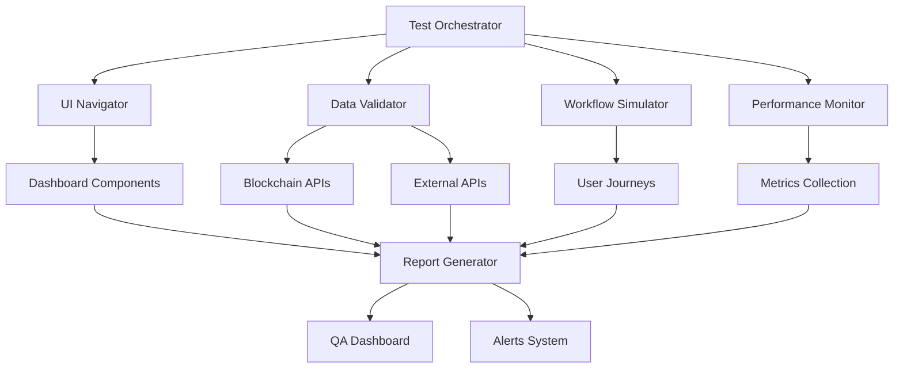

# Design Document

## Overview

The Automated Dashboard Testing System is a comprehensive testing framework that validates the AION Dashboard's functionality, data accuracy, and user experience. The system uses automated browser testing, real-time data validation, and intelligent workflow simulation to ensure professional quality suitable for hackathon demonstrations.

## Architecture

### Core Components

1. **Test Orchestrator**: Central coordinator managing test execution, scheduling, and reporting
2. **UI Navigator**: Automated browser controller for interacting with dashboard components
3. **Data Validator**: Real-time validation engine for blockchain and API data accuracy
4. **Workflow Simulator**: User journey simulation engine for end-to-end testing
5. **Performance Monitor**: System performance and response time tracking
6. **Report Generator**: Comprehensive test reporting and QA scoring system

### System Flow



## Components and Interfaces

### Test Orchestrator

**Purpose**: Manages test execution lifecycle and coordinates all testing components

**Interface**:
```typescript
interface TestOrchestrator {
  startAutomatedTesting(): Promise<TestResults>
  schedulePeriodicTesting(interval: number): void
  stopTesting(): void
  getTestStatus(): TestStatus
  generateReport(): TestReport
}
```

**Key Methods**:
- `executeTestSuite()`: Runs complete test suite
- `validateConfiguration()`: Ensures test environment is ready
- `handleTestFailures()`: Manages test failure scenarios

### UI Navigator

**Purpose**: Automates browser interactions with dashboard components

**Interface**:
```typescript
interface UINavigator {
  navigateToComponent(component: DashboardComponent): Promise<void>
  clickButton(buttonSelector: string): Promise<void>
  validateElementPresence(selector: string): Promise<boolean>
  extractDataFromElement(selector: string): Promise<string>
  simulateUserInput(input: UserInput): Promise<void>
}
```

**Components to Test**:
- Wallet Panel (balance, address, deposit/withdraw buttons)
- Vault Performance (APY tracking, performance charts)
- Strategies Overview (Venus, Beefy, Pancake, Aave, etc.)
- Market Overview (BNB price, Market Cap, Volume, Fear & Greed)
- Protocol Performance section
- Portfolio Metrics and Yield Opportunities
- AI Agent & AI Insights panels
- Risk Management dashboard
- Gas tracker and Network status
- History, Quick Stats, System Health, Alerts, Recommendations

### Data Validator

**Purpose**: Validates real-time data accuracy against blockchain and API sources

**Interface**:
```typescript
interface DataValidator {
  validateBlockchainData(component: string, displayedData: any): Promise<ValidationResult>
  validateAPIData(endpoint: string, displayedData: any): Promise<ValidationResult>
  checkDataFreshness(timestamp: number): boolean
  validateCalculations(metrics: FinancialMetrics): ValidationResult
}
```

**Validation Types**:
- APY calculations and display accuracy
- Balance synchronization with blockchain
- Vault shares and performance metrics
- Gas price accuracy
- Market data freshness
- AI recommendation relevance

### Workflow Simulator

**Purpose**: Simulates realistic user journeys and validates end-to-end workflows

**Interface**:
```typescript
interface WorkflowSimulator {
  simulateDepositFlow(amount: number): Promise<WorkflowResult>
  simulateWithdrawFlow(amount: number): Promise<WorkflowResult>
  simulateStrategyAllocation(strategy: string): Promise<WorkflowResult>
  simulateRebalancing(): Promise<WorkflowResult>
  validateWorkflowIntegrity(workflow: UserWorkflow): Promise<ValidationResult>
}
```

**User Journeys**:
1. **Deposit Journey**: Connect wallet → Check balance → Enter amount → Execute deposit → Verify metrics update
2. **Strategy Journey**: View strategies → Compare APYs → Select strategy → Allocate funds → Monitor performance
3. **Monitoring Journey**: Check portfolio → Review AI recommendations → Adjust allocations → Track performance
4. **Rebalancing Journey**: Analyze performance → Get AI insights → Execute rebalancing → Verify results

### Performance Monitor

**Purpose**: Tracks system performance and response times

**Interface**:
```typescript
interface PerformanceMonitor {
  measureResponseTime(action: string): Promise<number>
  trackLoadingStates(): Promise<LoadingMetrics>
  monitorMemoryUsage(): Promise<MemoryMetrics>
  validatePerformanceThresholds(): Promise<PerformanceReport>
}
```

**Metrics Tracked**:
- Page load times
- API response times
- Component rendering performance
- Memory usage patterns
- Network request efficiency

## Data Models

### Test Configuration

```typescript
interface TestConfiguration {
  testSuites: TestSuite[]
  schedulingOptions: SchedulingOptions
  validationThresholds: ValidationThresholds
  reportingSettings: ReportingSettings
  environmentSettings: EnvironmentSettings
}

interface TestSuite {
  name: string
  components: DashboardComponent[]
  workflows: UserWorkflow[]
  validationRules: ValidationRule[]
  performanceThresholds: PerformanceThreshold[]
}
```

### Test Results

```typescript
interface TestResults {
  overallScore: number
  componentResults: ComponentTestResult[]
  workflowResults: WorkflowTestResult[]
  performanceMetrics: PerformanceMetrics
  dataValidationResults: DataValidationResult[]
  recommendations: Recommendation[]
  timestamp: Date
}

interface ComponentTestResult {
  componentName: string
  passed: boolean
  issues: Issue[]
  performanceScore: number
  dataAccuracy: number
}
```

### Validation Results

```typescript
interface ValidationResult {
  isValid: boolean
  accuracy: number
  discrepancies: Discrepancy[]
  lastUpdated: Date
  source: DataSource
}

interface Discrepancy {
  field: string
  expected: any
  actual: any
  severity: 'low' | 'medium' | 'high' | 'critical'
  impact: string
}
```

## Error Handling

### Error Categories

1. **UI Interaction Errors**: Element not found, click failures, navigation issues
2. **Data Validation Errors**: Stale data, calculation mismatches, API failures
3. **Performance Errors**: Slow response times, memory leaks, timeout issues
4. **Workflow Errors**: Broken user journeys, transaction failures, state inconsistencies

### Error Recovery Strategies

```typescript
interface ErrorHandler {
  handleUIError(error: UIError): Promise<RecoveryAction>
  handleDataError(error: DataError): Promise<RecoveryAction>
  handlePerformanceError(error: PerformanceError): Promise<RecoveryAction>
  handleWorkflowError(error: WorkflowError): Promise<RecoveryAction>
}
```

### Retry Logic

- **UI Interactions**: 3 retries with exponential backoff
- **Data Validation**: 2 retries with fresh data fetch
- **Performance Tests**: Single retry after system stabilization
- **Workflow Tests**: Context-aware retry with state restoration

## Testing Strategy

### Test Execution Phases

1. **Pre-Test Setup**: Environment validation, dependency checks, configuration loading
2. **Component Testing**: Individual component validation and interaction testing
3. **Integration Testing**: Cross-component workflow validation
4. **Performance Testing**: Response time and resource usage measurement
5. **Data Validation**: Real-time data accuracy verification
6. **Report Generation**: Comprehensive results compilation and scoring

### Test Scheduling

```typescript
interface TestScheduler {
  scheduleImmediate(): void
  schedulePeriodicTesting(interval: number): void
  scheduleConditionalTesting(triggers: TestTrigger[]): void
  pauseScheduledTesting(): void
  resumeScheduledTesting(): void
}
```

### Quality Scoring Algorithm

```typescript
interface QualityScorer {
  calculateOverallScore(results: TestResults): number
  calculateComponentScore(component: ComponentTestResult): number
  calculateWorkflowScore(workflow: WorkflowTestResult): number
  generateImprovementSuggestions(results: TestResults): Recommendation[]
}
```

**Scoring Weights**:
- Data Accuracy: 30%
- UI Functionality: 25%
- Performance: 20%
- Workflow Integrity: 15%
- Error Handling: 10%

### Hackathon Readiness Assessment

```typescript
interface HackathonReadinessAssessor {
  assessPresentationReadiness(): ReadinessScore
  identifyWowFactors(): WowFactor[]
  suggestImprovements(): ImprovementSuggestion[]
  validateDemoScenarios(): DemoValidationResult[]
}
```

**Assessment Criteria**:
- Visual polish and professional appearance
- Data accuracy and real-time updates
- Smooth user experience and workflows
- Impressive features and capabilities
- Error-free demonstration scenarios

## Implementation Considerations

### Technology Stack

- **Browser Automation**: Playwright or Puppeteer for UI testing
- **Data Validation**: Custom validation engine with blockchain integration
- **Performance Monitoring**: Built-in performance APIs and custom metrics
- **Reporting**: React-based dashboard with real-time updates
- **Scheduling**: Node.js cron jobs with configurable intervals

### Integration Points

- **Frontend Integration**: Direct integration with React components
- **Blockchain Integration**: Web3 providers for real-time data validation
- **API Integration**: REST and WebSocket connections for external data
- **Monitoring Integration**: Integration with existing error tracking systems

### Scalability Considerations

- **Parallel Testing**: Multiple test suites running concurrently
- **Resource Management**: Efficient memory and CPU usage
- **Test Data Management**: Efficient storage and retrieval of test results
- **Reporting Scalability**: Real-time dashboard updates without performance impact