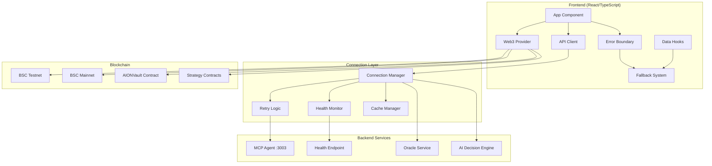
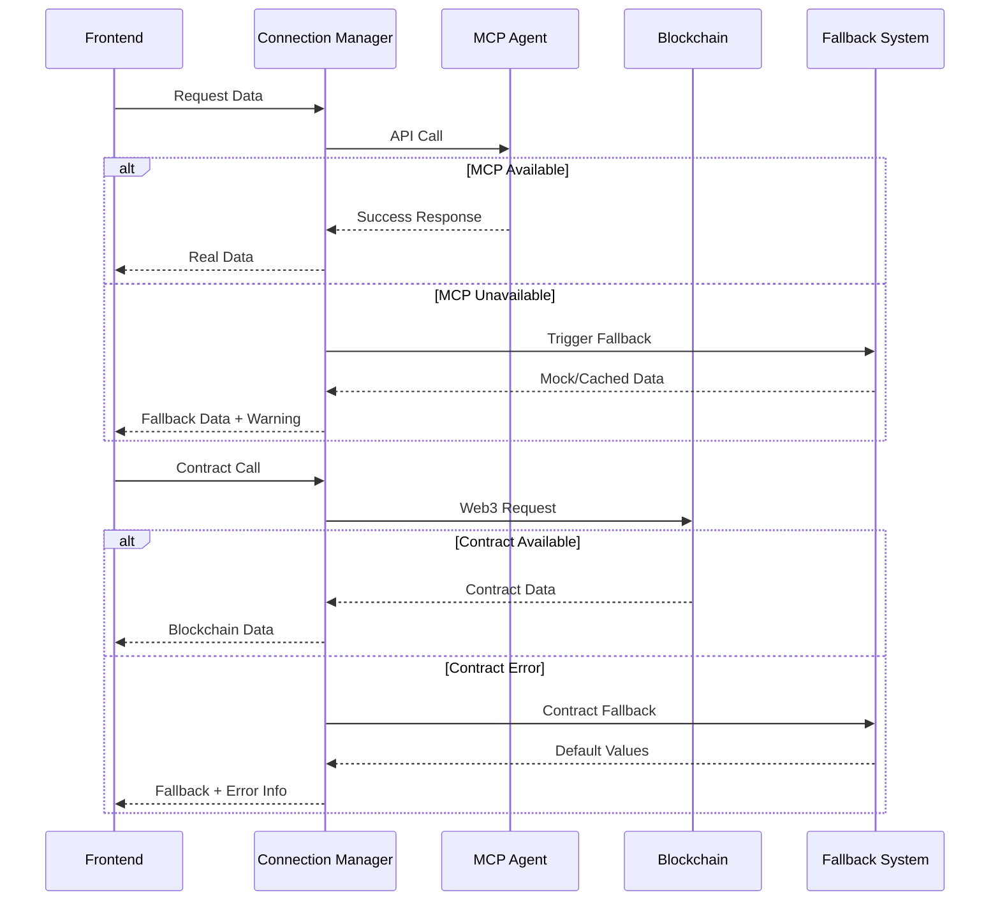

# Design Document

## Overview

This design document outlines the comprehensive solution for fixing critical connection and configuration issues in the AION frontend application. The solution addresses MCP Agent backend connectivity, Web3 configuration problems, API endpoint standardization, and data validation issues.

The design implements a robust, fault-tolerant architecture with proper error handling, fallback mechanisms, and development environment setup to ensure reliable operation of the complete AION DeFi system.

## Architecture

### System Connection Architecture



### Data Flow and Error Handling



## Components and Interfaces

### Enhanced Connection Manager

```typescript
interface ConnectionConfig {
  mcpUrl: string;
  retryAttempts: number;
  retryDelay: number;
  timeout: number;
  healthCheckInterval: number;
}

interface ConnectionStatus {
  mcp: 'connected' | 'disconnected' | 'error';
  web3: 'connected' | 'disconnected' | 'error';
  lastHealthCheck: Date;
  errorCount: number;
}

class ConnectionManager {
  private config: ConnectionConfig;
  private status: ConnectionStatus;
  private healthCheckTimer?: NodeJS.Timeout;
  
  constructor(config: ConnectionConfig) {
    this.config = config;
    this.status = {
      mcp: 'disconnected',
      web3: 'disconnected',
      lastHealthCheck: new Date(),
      errorCount: 0
    };
  }
  
  async initialize(): Promise<void> {
    await this.checkMCPHealth();
    await this.checkWeb3Health();
    this.startHealthMonitoring();
  }
  
  async checkMCPHealth(): Promise<boolean> {
    try {
      const response = await fetch(`${this.config.mcpUrl}/api/health`, {
        method: 'GET',
        timeout: this.config.timeout
      });
      
      if (response.ok) {
        this.status.mcp = 'connected';
        this.status.errorCount = 0;
        return true;
      }
    } catch (error) {
      this.status.mcp = 'error';
      this.status.errorCount++;
      console.warn('MCP health check failed:', error);
    }
    
    return false;
  }
  
  async makeRequest<T>(
    endpoint: string, 
    options?: RequestInit
  ): Promise<ApiResponse<T>> {
    return this.withRetry(async () => {
      const response = await fetch(`${this.config.mcpUrl}${endpoint}`, {
        ...options,
        timeout: this.config.timeout
      });
      
      if (!response.ok) {
        throw new Error(`HTTP ${response.status}: ${response.statusText}`);
      }
      
      const data = await response.json();
      return { success: true, data };
    });
  }
  
  private async withRetry<T>(
    operation: () => Promise<T>
  ): Promise<T> {
    let lastError: Error;
    
    for (let attempt = 1; attempt <= this.config.retryAttempts; attempt++) {
      try {
        return await operation();
      } catch (error) {
        lastError = error as Error;
        
        if (attempt < this.config.retryAttempts) {
          const delay = this.config.retryDelay * Math.pow(2, attempt - 1);
          await new Promise(resolve => setTimeout(resolve, delay));
        }
      }
    }
    
    throw lastError!;
  }
}
```

### Enhanced API Client with Fallback

```typescript
interface ApiClientConfig {
  baseUrl: string;
  timeout: number;
  retryAttempts: number;
  fallbackEnabled: boolean;
}

class EnhancedApiClient {
  private connectionManager: ConnectionManager;
  private fallbackSystem: FallbackSystem;
  
  constructor(config: ApiClientConfig) {
    this.connectionManager = new ConnectionManager({
      mcpUrl: config.baseUrl,
      retryAttempts: config.retryAttempts,
      retryDelay: 1000,
      timeout: config.timeout,
      healthCheckInterval: 30000
    });
    
    this.fallbackSystem = new FallbackSystem();
  }
  
  async getMarketSnapshot(network: string): Promise<ApiResponse<MarketSnapshot>> {
    try {
      const response = await this.connectionManager.makeRequest<MarketSnapshot>(
        `/api/oracle/snapshot?network=${network}`
      );
      
      // Cache successful response
      this.fallbackSystem.cacheData('marketSnapshot', response.data);
      return response;
      
    } catch (error) {
      console.warn('Market snapshot failed, using fallback:', error);
      
      const fallbackData = this.fallbackSystem.getMarketSnapshot(network);
      return {
        success: true,
        data: fallbackData,
        warning: 'Using cached/fallback data due to connection issues'
      };
    }
  }
  
  async getVaultStats(network: string): Promise<ApiResponse<VaultStats>> {
    try {
      return await this.connectionManager.makeRequest<VaultStats>(
        `/api/vault/stats?network=${network}`
      );
    } catch (error) {
      console.warn('Vault stats failed, using fallback:', error);
      
      const fallbackData = this.fallbackSystem.getVaultStats();
      return {
        success: true,
        data: fallbackData,
        warning: 'Using fallback data - MCP Agent unavailable'
      };
    }
  }
  
  async getSystemHealth(): Promise<ApiResponse<SystemHealth>> {
    try {
      return await this.connectionManager.makeRequest<SystemHealth>('/api/health');
    } catch (error) {
      return {
        success: false,
        error: 'MCP Agent unavailable',
        data: {
          status: 'degraded',
          services: {
            mcp: 'offline',
            oracle: 'unknown',
            web3: 'unknown'
          },
          lastCheck: new Date().toISOString()
        }
      };
    }
  }
}
```

### Robust Web3 Configuration

```typescript
import { createConfig, http } from 'wagmi';
import { bsc, bscTestnet } from 'wagmi/chains';
import { getDefaultConfig } from '@rainbow-me/rainbowkit';

interface Web3ConfigOptions {
  projectId: string;
  appName: string;
  enableTestnets: boolean;
}

class Web3ConfigManager {
  private config: Config;
  private contractAddresses: ContractAddresses;
  
  constructor(options: Web3ConfigOptions) {
    this.config = this.createWagmiConfig(options);
    this.contractAddresses = this.loadContractAddresses();
  }
  
  private createWagmiConfig(options: Web3ConfigOptions): Config {
    const chains = options.enableTestnets ? [bscTestnet, bsc] : [bsc];
    
    return getDefaultConfig({
      appName: options.appName,
      projectId: options.projectId,
      chains,
      transports: {
        [bsc.id]: http('https://bsc-dataseed.binance.org/'),
        [bscTestnet.id]: http('https://data-seed-prebsc-1-s1.binance.org:8545/'),
      },
      ssr: false,
    });
  }
  
  private loadContractAddresses(): ContractAddresses {
    return {
      [bscTestnet.id]: {
        AION_VAULT: this.getEnvAddress('VITE_VAULT_ADDRESS_TESTNET') || 
                   '0x1234567890123456789012345678901234567890',
        VENUS_ADAPTER: '0x2345678901234567890123456789012345678901',
        BEEFY_ADAPTER: '0x3456789012345678901234567890123456789012',
        // ... other addresses
      },
      [bsc.id]: {
        AION_VAULT: this.getEnvAddress('VITE_VAULT_ADDRESS_MAINNET') || 
                   '0x5678901234567890123456789012345678901234',
        // ... mainnet addresses
      }
    };
  }
  
  private getEnvAddress(key: string): `0x${string}` | undefined {
    const address = import.meta.env[key] as string;
    return address && address.startsWith('0x') ? address as `0x${string}` : undefined;
  }
  
  getConfig(): Config {
    return this.config;
  }
  
  getContractAddress(chainId: number, contract: string): `0x${string}` {
    const addresses = this.contractAddresses[chainId];
    if (!addresses || !addresses[contract]) {
      throw new Error(`Contract ${contract} not found for chain ${chainId}`);
    }
    return addresses[contract];
  }
  
  isContractDeployed(chainId: number, contract: string): boolean {
    try {
      const address = this.getContractAddress(chainId, contract);
      return address !== '0x0000000000000000000000000000000000000000';
    } catch {
      return false;
    }
  }
}
```

### Fallback System Implementation

```typescript
interface CachedData {
  data: any;
  timestamp: Date;
  ttl: number; // Time to live in milliseconds
}

class FallbackSystem {
  private cache: Map<string, CachedData> = new Map();
  private mockData: MockDataProvider;
  
  constructor() {
    this.mockData = new MockDataProvider();
  }
  
  cacheData(key: string, data: any, ttl: number = 300000): void { // 5 minutes default
    this.cache.set(key, {
      data,
      timestamp: new Date(),
      ttl
    });
  }
  
  getCachedData(key: string): any | null {
    const cached = this.cache.get(key);
    if (!cached) return null;
    
    const age = Date.now() - cached.timestamp.getTime();
    if (age > cached.ttl) {
      this.cache.delete(key);
      return null;
    }
    
    return cached.data;
  }
  
  getMarketSnapshot(network: string): MarketSnapshot {
    // Try cache first
    const cached = this.getCachedData('marketSnapshot');
    if (cached) {
      return { ...cached, stale: true };
    }
    
    // Fall back to mock data
    return this.mockData.getMarketSnapshot(network);
  }
  
  getVaultStats(): VaultStats {
    const cached = this.getCachedData('vaultStats');
    if (cached) {
      return { ...cached, stale: true };
    }
    
    return this.mockData.getVaultStats();
  }
}

class MockDataProvider {
  getMarketSnapshot(network: string): MarketSnapshot {
    return {
      network,
      bnb_price_usd: 326.12,
      protocols: {
        venus: { apy: 4.83, tvl_usd: 123456789, health: 'healthy' },
        pancake: { apy: 12.4, tvl_usd: 98765432, health: 'healthy' },
        beefy: { apy: 8.7, tvl_usd: 45678901, health: 'healthy' },
        aave: { apy: 6.2, tvl_usd: 78901234, health: 'healthy' }
      },
      last_updated: new Date().toISOString(),
      stale: true,
      source: 'fallback'
    };
  }
  
  getVaultStats(): VaultStats {
    return {
      balance: 0,
      shares: 0,
      dailyProfit: 0,
      apy: 0,
      strategy: 'Not connected',
      stale: true,
      source: 'fallback'
    };
  }
}
```

## Data Models

### Enhanced Response Types

```typescript
interface ApiResponse<T> {
  success: boolean;
  data?: T;
  error?: string;
  warning?: string;
  source?: 'live' | 'cached' | 'fallback';
  timestamp?: string;
}

interface MarketSnapshot {
  network: string;
  bnb_price_usd: number;
  protocols: {
    venus: ProtocolData;
    pancake: ProtocolData;
    beefy?: ProtocolData;
    aave?: ProtocolData;
  };
  last_updated: string;
  stale: boolean;
  source?: 'live' | 'cached' | 'fallback';
}

interface ProtocolData {
  apy: number;
  tvl_usd: number;
  health: 'healthy' | 'degraded' | 'critical';
  last_updated?: string;
  source?: 'live' | 'defillama' | 'fallback';
}

interface VaultStats {
  balance: number;
  shares: number;
  dailyProfit: number;
  apy: number;
  strategy: string;
  lastUpdated?: string;
  stale?: boolean;
  source?: 'live' | 'cached' | 'fallback';
}

interface SystemHealth {
  status: 'healthy' | 'degraded' | 'critical';
  services: {
    mcp: 'online' | 'offline' | 'degraded';
    oracle: 'online' | 'offline' | 'degraded';
    web3: 'online' | 'offline' | 'degraded';
  };
  lastCheck: string;
  uptime?: number;
  version?: string;
}
```

### Contract Integration Types

```typescript
interface ContractConfig {
  address: `0x${string}`;
  abi: any[];
  chainId: number;
}

interface ContractCallResult<T> {
  success: boolean;
  data?: T;
  error?: string;
  blockNumber?: number;
  gasUsed?: bigint;
}

interface TransactionResult {
  success: boolean;
  hash?: `0x${string}`;
  receipt?: TransactionReceipt;
  error?: string;
  gasUsed?: bigint;
  gasPrice?: bigint;
}
```

## Error Handling

### Comprehensive Error Classification

```typescript
enum ErrorType {
  NETWORK_ERROR = 'NETWORK_ERROR',
  CONTRACT_ERROR = 'CONTRACT_ERROR',
  VALIDATION_ERROR = 'VALIDATION_ERROR',
  CONFIGURATION_ERROR = 'CONFIGURATION_ERROR',
  TIMEOUT_ERROR = 'TIMEOUT_ERROR'
}

interface AppError {
  type: ErrorType;
  code: string;
  message: string;
  details?: any;
  recoverable: boolean;
  userMessage: string;
  suggestedActions: string[];
}

class ErrorHandler {
  static handleApiError(error: any): AppError {
    if (error.name === 'AbortError') {
      return {
        type: ErrorType.TIMEOUT_ERROR,
        code: 'API_TIMEOUT',
        message: 'Request timed out',
        recoverable: true,
        userMessage: 'The request took too long. Please try again.',
        suggestedActions: ['Retry the request', 'Check your internet connection']
      };
    }
    
    if (error.message?.includes('Failed to fetch')) {
      return {
        type: ErrorType.NETWORK_ERROR,
        code: 'CONNECTION_FAILED',
        message: 'Failed to connect to backend',
        recoverable: true,
        userMessage: 'Unable to connect to the server. Using cached data.',
        suggestedActions: [
          'Check if the MCP Agent is running',
          'Verify network connection',
          'Try refreshing the page'
        ]
      };
    }
    
    return {
      type: ErrorType.NETWORK_ERROR,
      code: 'UNKNOWN_API_ERROR',
      message: error.message || 'Unknown API error',
      recoverable: true,
      userMessage: 'Something went wrong. Please try again.',
      suggestedActions: ['Retry the request', 'Contact support if the issue persists']
    };
  }
  
  static handleContractError(error: any): AppError {
    if (error.message?.includes('config.getClient is not a function')) {
      return {
        type: ErrorType.CONFIGURATION_ERROR,
        code: 'WEB3_CONFIG_ERROR',
        message: 'Web3 configuration error',
        recoverable: true,
        userMessage: 'Wallet connection issue. Please reconnect your wallet.',
        suggestedActions: [
          'Disconnect and reconnect your wallet',
          'Refresh the page',
          'Switch to a supported network'
        ]
      };
    }
    
    if (error.message?.includes('User rejected')) {
      return {
        type: ErrorType.VALIDATION_ERROR,
        code: 'USER_REJECTED',
        message: 'Transaction rejected by user',
        recoverable: true,
        userMessage: 'Transaction was cancelled.',
        suggestedActions: ['Try the transaction again', 'Check transaction details']
      };
    }
    
    return {
      type: ErrorType.CONTRACT_ERROR,
      code: 'CONTRACT_CALL_FAILED',
      message: error.message || 'Contract call failed',
      recoverable: true,
      userMessage: 'Blockchain interaction failed. Please try again.',
      suggestedActions: [
        'Check your wallet connection',
        'Ensure you have enough gas',
        'Try again in a few moments'
      ]
    };
  }
}
```

### Error Recovery Strategies

```typescript
class ErrorRecoveryManager {
  private retryAttempts: Map<string, number> = new Map();
  private maxRetries = 3;
  
  async withRecovery<T>(
    operation: () => Promise<T>,
    errorKey: string,
    fallback?: () => T
  ): Promise<T> {
    const attempts = this.retryAttempts.get(errorKey) || 0;
    
    try {
      const result = await operation();
      this.retryAttempts.delete(errorKey); // Reset on success
      return result;
    } catch (error) {
      const appError = this.classifyError(error);
      
      if (appError.recoverable && attempts < this.maxRetries) {
        this.retryAttempts.set(errorKey, attempts + 1);
        
        // Exponential backoff
        const delay = Math.pow(2, attempts) * 1000;
        await new Promise(resolve => setTimeout(resolve, delay));
        
        return this.withRecovery(operation, errorKey, fallback);
      }
      
      if (fallback) {
        console.warn(`Operation failed after ${attempts} retries, using fallback:`, error);
        return fallback();
      }
      
      throw appError;
    }
  }
  
  private classifyError(error: any): AppError {
    if (error.message?.includes('fetch')) {
      return ErrorHandler.handleApiError(error);
    }
    
    if (error.message?.includes('contract') || error.message?.includes('getClient')) {
      return ErrorHandler.handleContractError(error);
    }
    
    return {
      type: ErrorType.NETWORK_ERROR,
      code: 'UNKNOWN_ERROR',
      message: error.message || 'Unknown error',
      recoverable: false,
      userMessage: 'An unexpected error occurred.',
      suggestedActions: ['Refresh the page', 'Contact support']
    };
  }
}
```

## Testing Strategy

### Connection Testing

```typescript
describe('Connection Manager', () => {
  test('should handle MCP Agent unavailable', async () => {
    const manager = new ConnectionManager({
      mcpUrl: 'http://localhost:9999', // Non-existent port
      retryAttempts: 2,
      retryDelay: 100,
      timeout: 1000,
      healthCheckInterval: 5000
    });
    
    const isHealthy = await manager.checkMCPHealth();
    expect(isHealthy).toBe(false);
    expect(manager.getStatus().mcp).toBe('error');
  });
  
  test('should retry failed requests', async () => {
    const manager = new ConnectionManager(testConfig);
    let attempts = 0;
    
    const mockOperation = jest.fn().mockImplementation(() => {
      attempts++;
      if (attempts < 3) {
        throw new Error('Network error');
      }
      return { success: true, data: 'test' };
    });
    
    const result = await manager.withRetry(mockOperation);
    expect(attempts).toBe(3);
    expect(result.success).toBe(true);
  });
});
```

### Fallback System Testing

```typescript
describe('Fallback System', () => {
  test('should provide mock data when cache is empty', () => {
    const fallback = new FallbackSystem();
    const marketData = fallback.getMarketSnapshot('bscTestnet');
    
    expect(marketData.network).toBe('bscTestnet');
    expect(marketData.stale).toBe(true);
    expect(marketData.source).toBe('fallback');
  });
  
  test('should use cached data when available', () => {
    const fallback = new FallbackSystem();
    const testData = { test: 'data', timestamp: new Date() };
    
    fallback.cacheData('test', testData, 60000);
    const retrieved = fallback.getCachedData('test');
    
    expect(retrieved).toEqual(testData);
  });
});
```

## Implementation Phases

### Phase 1: Connection Infrastructure (Days 1-2)
1. **Connection Manager**: Implement robust connection management with health monitoring
2. **Error Handling**: Set up comprehensive error classification and recovery
3. **Fallback System**: Create mock data providers and caching mechanisms
4. **Configuration**: Fix Web3 configuration and contract address management

### Phase 2: API Integration (Days 3-4)
1. **Enhanced API Client**: Implement retry logic and fallback integration
2. **Data Validation**: Add proper null checks and data structure validation
3. **Endpoint Standardization**: Ensure all endpoints use correct MCP Agent URL
4. **Response Handling**: Implement proper success/error response processing

### Phase 3: Web3 Integration (Days 5-6)
1. **Contract Configuration**: Fix wagmi/viem configuration issues
2. **Contract Calls**: Implement robust contract interaction with error handling
3. **Transaction Management**: Add proper transaction validation and monitoring
4. **Network Management**: Implement automatic network detection and switching

### Phase 4: User Experience (Days 7-8)
1. **Loading States**: Add proper loading indicators and skeleton screens
2. **Error Messages**: Implement user-friendly error messages with recovery actions
3. **Data Indicators**: Show data source, freshness, and reliability status
4. **Performance**: Optimize data fetching and caching strategies

### Phase 5: Testing and Documentation (Days 9-10)
1. **Integration Testing**: Test all connection scenarios and error cases
2. **Performance Testing**: Verify loading times and error recovery
3. **Documentation**: Create setup guides and troubleshooting documentation
4. **Deployment**: Prepare production-ready configuration and monitoring

## Security Considerations

### API Security
- **Input Validation**: Validate all API inputs and responses
- **Rate Limiting**: Implement client-side rate limiting to prevent abuse
- **Error Information**: Avoid exposing sensitive information in error messages
- **HTTPS Enforcement**: Ensure all API calls use HTTPS in production

### Web3 Security
- **Private Key Protection**: Never store or log private keys
- **Transaction Validation**: Validate all transaction parameters before signing
- **Contract Verification**: Verify contract addresses and ABIs before interaction
- **Network Validation**: Ensure users are on the correct network before transactions

### Data Privacy
- **Local Storage**: Minimize sensitive data in browser storage
- **Error Logging**: Log errors without exposing user data
- **Analytics**: Implement privacy-respecting usage analytics
- **Data Retention**: Clear cached data appropriately

This design provides a comprehensive solution for fixing the critical connection and configuration issues while establishing a robust foundation for reliable frontend operation.