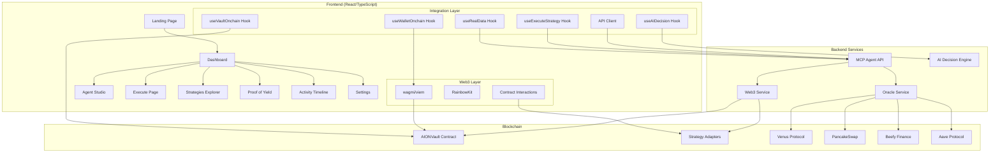

# Design Document

## Overview

This design document outlines the comprehensive integration architecture for connecting the AION frontend with smart contracts and the MCP Agent backend. The solution creates a production-ready DeFi application with real-time data, AI-powered recommendations, and seamless Web3 integration.

The design follows a layered architecture approach:
- **Presentation Layer**: React components with real-time data binding
- **Integration Layer**: Custom hooks and services for Web3 and API communication  
- **Data Layer**: Smart contracts and MCP Agent backend
- **State Management**: Optimistic updates with error recovery

## Architecture

### System Architecture Diagram



### Data Flow Architecture

The application implements a unidirectional data flow with optimistic updates:

1. **User Actions** → Component Events → Hook Calls → API/Contract Calls
2. **Real-time Updates** → WebSocket/Polling → State Updates → UI Re-render
3. **Error Handling** → Error Boundaries → User Feedback → Recovery Actions

## Components and Interfaces

### Core Integration Hooks

#### Enhanced useRealData Hook
```typescript
interface RealDataState {
  marketData: MarketSnapshot | null;
  vaultStats: VaultStats | null;
  systemHealth: SystemHealth | null;
  loading: boolean;
  error: string | null;
  lastUpdated: Date | null;
  isLive: boolean;
}

interface MarketSnapshot {
  network: string;
  bnb_price_usd: number;
  protocols: {
    venus: ProtocolData;
    pancake: ProtocolData;
    beefy: ProtocolData;
    aave: ProtocolData;
  };
  sources: {
    price: 'live' | 'fallback';
    protocols: 'live' | 'mixed' | 'fallback';
  };
  last_updated: string;
  stale: boolean;
}
```

#### Enhanced useVaultOnchain Hook
```typescript
interface VaultOnchainState {
  // User Data
  balanceBNB: number | null;
  shares: number | null;
  principal: number | null;
  earnings: UserEarnings | null;
  
  // Vault Data
  totalAssets: number | null;
  totalShares: number | null;
  currentStrategy: string | null;
  
  // Operations
  loading: boolean;
  error: string | null;
  refresh: () => void;
  
  // Transaction Methods
  deposit: (amount: string) => Promise<TransactionResult>;
  withdraw: (shares: string) => Promise<TransactionResult>;
  withdrawAll: () => Promise<TransactionResult>;
}
```

#### New useStrategyExecution Hook
```typescript
interface StrategyExecutionState {
  // Execution State
  executing: boolean;
  currentStep: ExecutionStep;
  progress: number;
  
  // Transaction Data
  txHash: string | null;
  gasEstimate: GasEstimate | null;
  
  // Methods
  executeDeposit: (params: DepositParams) => Promise<ExecutionResult>;
  executeWithdraw: (params: WithdrawParams) => Promise<ExecutionResult>;
  executeRebalance: (params: RebalanceParams) => Promise<ExecutionResult>;
  
  // Simulation
  simulateTransaction: (params: TransactionParams) => Promise<SimulationResult>;
}
```

### API Integration Layer

#### Enhanced API Client
```typescript
class EnhancedApiClient {
  // Market Data
  async getMarketSnapshot(network: string): Promise<ApiResponse<MarketSnapshot>>;
  async getHistoricalData(protocol: string, timeframe: string): Promise<ApiResponse<HistoricalData[]>>;
  
  // Vault Operations
  async getVaultStats(network: string): Promise<ApiResponse<VaultStats>>;
  async getProofOfYield(network: string): Promise<ApiResponse<ProofData>>;
  
  // AI Integration
  async getAIDecision(params: DecisionParams): Promise<ApiResponse<AIDecision>>;
  async executeStrategy(request: ExecutionRequest): Promise<ApiResponse<ExecutionResult>>;
  
  // Transaction History
  async getTransactionHistory(address?: string): Promise<ApiResponse<Transaction[]>>;
  
  // System Health
  async getSystemHealth(): Promise<ApiResponse<HealthStatus>>;
  
  // WebSocket for real-time updates
  subscribeToUpdates(callback: (data: RealtimeUpdate) => void): () => void;
}
```

### Smart Contract Integration

#### Contract Configuration
```typescript
interface ContractConfig {
  [chainId: number]: {
    AION_VAULT: `0x${string}`;
    VENUS_ADAPTER: `0x${string}`;
    BEEFY_ADAPTER: `0x${string}`;
    PANCAKE_ADAPTER: `0x${string}`;
    AAVE_ADAPTER: `0x${string}`;
  };
}

interface VaultABI {
  // Core Functions
  deposit: (amount: bigint) => Promise<TransactionReceipt>;
  withdraw: (shares: bigint) => Promise<TransactionReceipt>;
  withdrawAll: () => Promise<TransactionReceipt>;
  
  // View Functions
  balanceOf: (address: `0x${string}`) => Promise<bigint>;
  sharesOf: (address: `0x${string}`) => Promise<bigint>;
  totalAssets: () => Promise<bigint>;
  totalShares: () => Promise<bigint>;
  
  // Strategy Functions
  setCurrentAdapter: (adapter: `0x${string}`) => Promise<TransactionReceipt>;
  rebalance: (from: `0x${string}`, to: `0x${string}`, amount: bigint) => Promise<TransactionReceipt>;
}
```

## Data Models

### User Data Models
```typescript
interface UserProfile {
  address: `0x${string}`;
  chainId: number;
  balances: {
    BNB: number;
    USDC: number;
    ETH: number;
  };
  vaultPosition: {
    shares: number;
    balance: number;
    principal: number;
    earnings: number;
    apy: number;
  };
  preferences: {
    riskProfile: 'low' | 'medium' | 'high';
    preferredProtocols: string[];
    notifications: boolean;
  };
}

interface Transaction {
  id: string;
  type: 'deposit' | 'withdraw' | 'rebalance' | 'yield';
  amount: number;
  currency: string;
  strategy?: string;
  status: 'pending' | 'confirmed' | 'failed';
  timestamp: string;
  hash: string;
  gasUsed?: number;
  gasPrice?: number;
}
```

### Protocol Data Models
```typescript
interface ProtocolData {
  apy: number;
  tvl_usd: number;
  health: 'healthy' | 'degraded' | 'critical';
  liquidity: number;
  utilization: number;
  last_updated: string;
  source: 'live' | 'defillama' | 'fallback';
}

interface StrategyAdapter {
  address: `0x${string}`;
  name: string;
  protocol: string;
  apy: number;
  tvl: number;
  risk: 'low' | 'medium' | 'high';
  active: boolean;
  healthy: boolean;
  allocation: number;
}
```

## Error Handling

### Error Classification and Recovery

#### Network Errors
```typescript
interface NetworkError {
  type: 'NETWORK_ERROR';
  code: 'TIMEOUT' | 'CONNECTION_FAILED' | 'RATE_LIMITED';
  message: string;
  retryable: boolean;
  retryAfter?: number;
}

// Recovery Strategy: Exponential backoff with circuit breaker
class NetworkErrorHandler {
  async handleError(error: NetworkError): Promise<void> {
    if (error.retryable) {
      await this.retryWithBackoff();
    } else {
      this.showFallbackData();
    }
  }
}
```

#### Transaction Errors
```typescript
interface TransactionError {
  type: 'TRANSACTION_ERROR';
  code: 'INSUFFICIENT_FUNDS' | 'GAS_ESTIMATION_FAILED' | 'USER_REJECTED' | 'EXECUTION_REVERTED';
  message: string;
  suggestion: string;
  recoverable: boolean;
}

// Recovery Strategy: User guidance and alternative actions
class TransactionErrorHandler {
  handleError(error: TransactionError): UserAction[] {
    switch (error.code) {
      case 'INSUFFICIENT_FUNDS':
        return [
          { type: 'REDUCE_AMOUNT', label: 'Reduce deposit amount' },
          { type: 'ADD_FUNDS', label: 'Add funds to wallet' }
        ];
      case 'USER_REJECTED':
        return [
          { type: 'RETRY', label: 'Try again' },
          { type: 'CANCEL', label: 'Cancel transaction' }
        ];
      default:
        return [{ type: 'CONTACT_SUPPORT', label: 'Contact support' }];
    }
  }
}
```

#### Data Staleness Handling
```typescript
interface DataFreshnessIndicator {
  isLive: boolean;
  lastUpdated: Date;
  source: 'live' | 'cached' | 'fallback';
  staleness: 'fresh' | 'stale' | 'very_stale';
}

// Visual indicators for data quality
const DataQualityBadge: React.FC<{ freshness: DataFreshnessIndicator }> = ({ freshness }) => {
  const getBadgeColor = () => {
    if (freshness.isLive) return 'green';
    if (freshness.staleness === 'stale') return 'yellow';
    return 'red';
  };
  
  return (
    <Badge color={getBadgeColor()}>
      {freshness.isLive ? 'Live' : freshness.source}
    </Badge>
  );
};
```

## Testing Strategy

### Unit Testing
- **Component Testing**: React Testing Library for all UI components
- **Hook Testing**: Custom hook testing with mock providers
- **API Testing**: Mock API responses and error scenarios
- **Contract Testing**: Mock contract interactions with wagmi test utilities

### Integration Testing
- **End-to-End Flows**: Cypress tests for complete user journeys
- **API Integration**: Real API testing against development backend
- **Contract Integration**: Testnet contract interaction testing
- **Cross-browser Testing**: Chrome, Firefox, Safari, Mobile browsers

### Performance Testing
- **Load Testing**: Concurrent user simulation
- **Memory Testing**: Memory leak detection during long sessions
- **Network Testing**: Slow network and offline scenario testing
- **Bundle Analysis**: Code splitting and lazy loading optimization

### Security Testing
- **Input Validation**: XSS and injection attack prevention
- **Web3 Security**: Private key handling and transaction security
- **API Security**: Rate limiting and authentication testing
- **Dependency Scanning**: Automated vulnerability scanning

## Implementation Phases

### Phase 1: Core Infrastructure (Week 1)
1. **Enhanced API Client**: Implement robust API client with retry logic and caching
2. **Web3 Integration**: Set up wagmi, RainbowKit, and contract configurations
3. **Error Boundaries**: Implement comprehensive error handling system
4. **State Management**: Set up optimistic updates and cache invalidation

### Phase 2: Data Integration (Week 2)
1. **Real Data Hooks**: Implement enhanced useRealData and useVaultOnchain hooks
2. **Contract Integration**: Connect all contract read/write operations
3. **Market Data**: Integrate live protocol data from MCP Agent
4. **Fallback Systems**: Implement graceful degradation for offline scenarios

### Phase 3: User Interface Enhancement (Week 3)
1. **Dashboard Integration**: Connect dashboard to real data sources
2. **Strategy Explorer**: Implement live protocol comparison and selection
3. **Execute Page**: Build complete transaction flow with validation and simulation
4. **Agent Studio**: Integrate AI chat with real decision engine

### Phase 4: Advanced Features (Week 4)
1. **Transaction Monitoring**: Real-time transaction status and history
2. **Proof of Yield**: Implement transparent yield tracking and verification
3. **Performance Optimization**: Implement caching, lazy loading, and code splitting
4. **Mobile Optimization**: Ensure responsive design and mobile-specific features

### Phase 5: Production Readiness (Week 5)
1. **Security Audit**: Comprehensive security review and testing
2. **Performance Testing**: Load testing and optimization
3. **Documentation**: User guides and developer documentation
4. **Deployment**: Production deployment with monitoring and analytics

## Security Considerations

### Web3 Security
- **Private Key Protection**: Never store or transmit private keys
- **Transaction Validation**: Validate all transaction parameters before signing
- **Contract Verification**: Verify contract addresses and ABIs
- **Slippage Protection**: Implement maximum slippage limits for all transactions

### API Security
- **Rate Limiting**: Implement client-side rate limiting to prevent abuse
- **Input Sanitization**: Sanitize all user inputs before API calls
- **HTTPS Only**: Enforce HTTPS for all API communications
- **Error Information**: Avoid exposing sensitive information in error messages

### Data Privacy
- **Local Storage**: Minimize sensitive data in local storage
- **Analytics**: Implement privacy-respecting analytics
- **User Consent**: Clear consent mechanisms for data collection
- **Data Retention**: Implement appropriate data retention policies

## Performance Optimization

### Frontend Optimization
- **Code Splitting**: Lazy load pages and components
- **Bundle Optimization**: Tree shaking and dead code elimination
- **Image Optimization**: WebP format and responsive images
- **Caching Strategy**: Implement service worker for offline functionality

### Data Optimization
- **Request Batching**: Batch multiple API calls where possible
- **Caching Layers**: Multi-level caching (memory, localStorage, service worker)
- **Optimistic Updates**: Update UI immediately with rollback on failure
- **Background Sync**: Sync data in background for better UX

### Network Optimization
- **Connection Pooling**: Reuse connections for multiple requests
- **Compression**: Enable gzip/brotli compression
- **CDN Integration**: Use CDN for static assets
- **Preloading**: Preload critical resources and data

## Monitoring and Analytics

### Application Monitoring
- **Error Tracking**: Comprehensive error logging and alerting
- **Performance Monitoring**: Real-time performance metrics
- **User Analytics**: Privacy-respecting user behavior analytics
- **Business Metrics**: Track key business metrics (TVL, transactions, users)

### Infrastructure Monitoring
- **API Health**: Monitor API response times and error rates
- **Contract Monitoring**: Track contract interactions and gas usage
- **Network Monitoring**: Monitor blockchain network health
- **Security Monitoring**: Track security events and anomalies

This design provides a comprehensive foundation for implementing a production-ready DeFi application with real-time data integration, robust error handling, and excellent user experience.