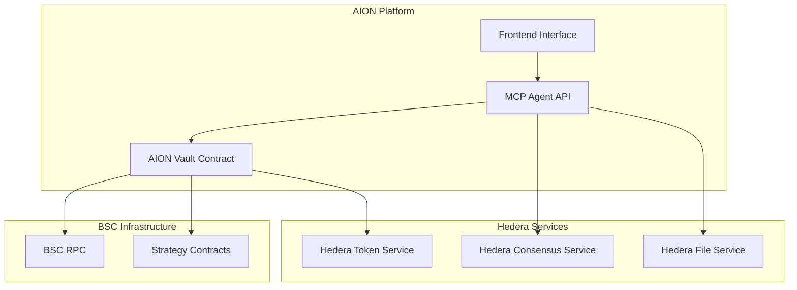
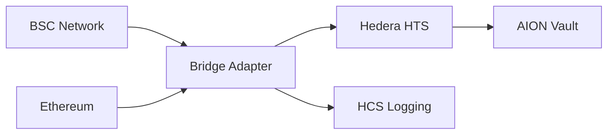
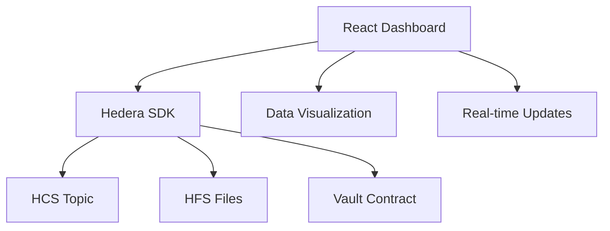

# Design Document

## Overview

The Hedera integration design extends the existing AION DeFi platform with native Hedera Hashgraph services while maintaining backward compatibility with BSC operations. The architecture introduces three key integration layers: HTS tokenization for vault shares, HCS audit trails for AI decisions, and HFS storage for model metadata. This design ensures transparency, immutability, and verifiability of all automated operations.

## Architecture

### High-Level Architecture



### Integration Flow

1. **User Interaction**: Users interact through existing frontend
2. **Dual Chain Operations**: Vault operates on BSC with Hedera services integration
3. **AI Decision Logging**: All AI decisions recorded on HCS via MCP Agent
4. **Model Versioning**: AI model metadata stored on HFS
5. **Token Management**: Vault shares represented as HTS tokens

## Components and Interfaces

### 1. Enhanced AION Vault Contract

**Location**: `contracts/src/AIONVaultHedera.sol`

**Key Features**:
- HTS integration for share tokenization
- Event emission for AI decision tracking
- Security controls (pause, time-lock, emergency)
- Hedera precompile interaction

**Interface Extensions**:
```solidity
interface IAIONVaultHedera {
    // HTS Operations
    function createShareToken(string memory name, string memory symbol, uint32 initialSupply) external returns (int64);
    function mintShares(address user, uint256 amount) external returns (uint256);
    function burnShares(address user, uint256 shares) external returns (uint256);
    
    // AI Decision Recording
    function recordAIDecision(string memory decisionCid, uint256 fromStrategy, uint256 toStrategy, uint256 amount) external;
    
    // Security Controls
    function pause() external;
    function unpause() external;
    function emergencyWithdraw(address user) external;
    
    // Events
    event AIRebalance(address indexed agent, uint256 timestamp, string decisionCid, uint256 fromStrategy, uint256 toStrategy, uint256 amount);
    event HTSTokenCreated(int64 tokenId, address tokenAddress);
    event SharesMinted(address indexed user, uint256 shares, int64 tokenId);
    event SharesBurned(address indexed user, uint256 shares, int64 tokenId);
}
```

### 2. Hedera Service Integration Layer

**Location**: `mcp_agent/services/hederaService.js`

**Responsibilities**:
- HCS message submission
- HFS file storage and retrieval
- Event monitoring and processing
- Hedera SDK integration

**Key Methods**:
```javascript
class HederaService {
    async submitDecisionToHCS(decisionData, topicId)
    async storeModelMetadata(metadata, fileId)
    async retrieveModelMetadata(fileId)
    async monitorVaultEvents(contractAddress)
    async createHCSTopicForVault(vaultAddress)
}
```

### 3. Hedera Libraries Integration

**Location**: `contracts/lib/hedera/`

**Required Files**:
- `IHederaTokenService.sol`: Interface for HTS precompile
- `HederaTokenService.sol`: Implementation helpers
- `HederaResponseCodes.sol`: Response code constants
- `SafeHederaService.sol`: Safe wrapper with error handling

### 4. Enhanced MCP Agent

**Location**: `mcp_agent/hederaAgent.js`

**New Capabilities**:
- Real-time event monitoring from vault contract
- Automatic HCS logging of AI decisions
- Model metadata management on HFS
- Cross-chain coordination between BSC and Hedera

## Data Models

### 1. HTS Share Token Structure

```solidity
struct ShareTokenInfo {
    int64 tokenId;           // Hedera token ID
    address tokenAddress;    // Mapped contract address
    string name;             // Token name
    string symbol;           // Token symbol
    uint256 totalSupply;     // Current total supply
    address treasury;        // Treasury account (vault contract)
}
```

### 2. AI Decision Log (HCS Message)

```javascript
{
    "txHash": "0x...",                    // BSC transaction hash
    "timestamp": 1640995200000,           // Unix timestamp
    "decision": {
        "type": "rebalance",
        "fromStrategy": "Venus",
        "toStrategy": "PancakeSwap",
        "amount": "1000000000000000000",
        "reason": "Higher yield opportunity"
    },
    "modelVersion": {
        "hash": "Qm...",                  // IPFS/HFS hash
        "version": "v2.1.3",
        "hfsFileId": "0.0.123456"
    },
    "performance": {
        "expectedYield": "12.5%",
        "riskScore": 0.3,
        "confidence": 0.95
    }
}
```

### 3. Model Metadata (HFS File)

```javascript
{
    "version": "v2.1.3",
    "checksum": "sha256:abc123...",
    "trainingData": {
        "startDate": "2024-01-01",
        "endDate": "2024-01-31",
        "samples": 50000
    },
    "performance": {
        "accuracy": 0.94,
        "precision": 0.92,
        "recall": 0.96
    },
    "parameters": {
        "learningRate": 0.001,
        "epochs": 100,
        "batchSize": 32
    }
}
```

## Error Handling

### 1. Hedera Service Errors

**HTS Errors**:
- Token creation failures
- Insufficient treasury balance
- Invalid token operations

**HCS Errors**:
- Topic submission failures
- Network connectivity issues
- Message size limitations

**HFS Errors**:
- File upload failures
- Storage quota exceeded
- File retrieval errors

### 2. Error Recovery Strategies

```javascript
class HederaErrorHandler {
    async handleHTSError(error, operation, retryCount = 0) {
        if (retryCount < 3) {
            await this.delay(1000 * Math.pow(2, retryCount));
            return this.retryHTSOperation(operation, retryCount + 1);
        }
        throw new Error(`HTS operation failed after 3 retries: ${error.message}`);
    }
    
    async handleHCSError(error, message, retryCount = 0) {
        // Implement exponential backoff for HCS submissions
        // Store failed messages for later retry
    }
    
    async handleHFSError(error, fileData, retryCount = 0) {
        // Implement file upload retry logic
        // Use alternative storage if HFS unavailable
    }
}
```

## Testing Strategy

### 1. Unit Tests

**Smart Contract Tests** (`contracts/test/AIONVaultHedera.t.sol`):
- HTS token creation and management
- AI decision recording functionality
- Security controls (pause, emergency)
- Event emission verification

**Service Tests** (`mcp_agent/tests/hederaService.test.js`):
- HCS message submission
- HFS file operations
- Error handling scenarios
- SDK integration

### 2. Integration Tests

**Cross-Service Tests**:
- End-to-end deposit/withdraw with HTS
- AI decision flow (BSC → HCS → HFS)
- Event monitoring and processing
- Multi-chain coordination

**Testnet Validation**:
- Deploy to Hedera testnet
- Execute full user journey
- Verify all service integrations
- Performance and reliability testing

### 3. Security Tests

**Access Control**:
- Role-based permission testing
- Unauthorized access prevention
- Emergency function validation

**Data Integrity**:
- HCS message immutability
- HFS file integrity verification
- Cross-reference validation

## Deployment Architecture

### 1. Network Configuration

**Hedera Testnet**:
- RPC Endpoint: `https://testnet.hashio.io/api`
- Account Setup: Testnet account with HBAR balance
- Service IDs: HCS topic, HFS storage allocation

**BSC Integration**:
- Maintain existing BSC testnet deployment
- Cross-chain event coordination
- Dual RPC configuration

### 2. Deployment Sequence

1. **Hedera Setup**:
   - Create testnet account
   - Fund with test HBAR
   - Create HCS topic for vault
   - Initialize HFS storage

2. **Contract Deployment**:
   - Deploy enhanced vault to BSC
   - Configure Hedera service parameters
   - Set up cross-chain coordination

3. **Agent Configuration**:
   - Update MCP agent with Hedera credentials
   - Configure service endpoints
   - Initialize monitoring systems

### 3. Environment Variables

```bash
# Hedera Configuration
HEDERA_NETWORK=testnet
HEDERA_ACCOUNT_ID=0.0.123456
HEDERA_PRIVATE_KEY=302e...
HEDERA_RPC_URL=https://testnet.hashio.io/api

# Service IDs
HCS_TOPIC_ID=0.0.789012
HFS_FILE_ID=0.0.345678

# BSC Configuration (existing)
BSC_RPC_URL=https://data-seed-prebsc-1-s1.binance.org:8545
VAULT_CONTRACT_ADDRESS=0x...
```

## Performance Considerations

### 1. Transaction Optimization

**Batch Operations**:
- Group multiple HTS operations
- Batch HCS message submissions
- Optimize gas usage on BSC side

**Caching Strategy**:
- Cache HFS file metadata locally
- Buffer HCS messages for batch submission
- Implement intelligent retry mechanisms

### 2. Scalability

**Concurrent Processing**:
- Parallel event monitoring
- Asynchronous service calls
- Queue management for high-volume operations

**Resource Management**:
- Connection pooling for Hedera SDK
- Memory optimization for large files
- Rate limiting for API calls

## Advanced Features

### 1. HSCS Compliance and Performance

**HSCS Integration**:
- Full compliance with Hedera Smart Contract Service
- Optimized gas usage for Hedera network
- Performance benchmarking against BSC operations
- Latest Hedera libraries (v0.38+) integration

### 2. Cross-Chain Bridge Support

**Bridge Architecture**:


**Bridge Components**:
- HTS ↔ ERC-20 token mapping
- Cross-chain operation validation
- Unified audit trail across chains
- Integration with Hashport or LayerZero

### 3. On-Chain Audit Hooks

**Audit Interface**:
```solidity
interface IAuditHooks {
    function getAIDecisions(uint256 from, uint256 to) external view returns (AIDecision[] memory);
    function getLatestModelSnapshot() external view returns (ModelSnapshot memory);
    function getTokenMetrics() external view returns (TokenMetrics memory);
}

struct AIDecision {
    uint256 timestamp;
    string decisionCid;
    uint256 fromStrategy;
    uint256 toStrategy;
    uint256 amount;
    bytes32 txHash;
}

struct ModelSnapshot {
    string hfsFileId;
    bytes32 checksum;
    uint256 timestamp;
    string version;
}
```

### 4. Transparency Dashboard

**Frontend Architecture**:


**Dashboard Features**:
- Real-time AI decision monitoring
- Model version tracking
- Token supply and holder analytics
- Cross-chain operation visibility
- Performance metrics display

## Security Considerations

### 1. Key Management

**Private Key Security**:
- Environment variable isolation
- Hardware security module integration
- Key rotation procedures

**Access Control**:
- Multi-signature requirements for critical operations
- Time-locked administrative functions
- Emergency pause mechanisms

### 2. Data Validation

**Input Sanitization**:
- Validate all user inputs
- Sanitize HCS message content
- Verify file integrity before HFS upload

**Cross-Chain Verification**:
- Validate BSC transaction hashes
- Verify HCS message authenticity
- Ensure data consistency across services

### 3. Formal Verification Readiness

**Mathematical Invariants**:
- Total shares conservation: `totalShares >= sum(sharesOf[user])`
- Balance consistency: `contractBalance >= totalDeposits - totalWithdrawals`
- Token supply integrity: `htsSupply == totalShares`

**Verification Tools**:
- Foundry property-based testing
- Gas optimization analysis
- Storage layout verification
- Invariant checking in all state transitions