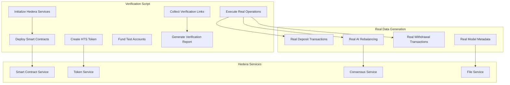
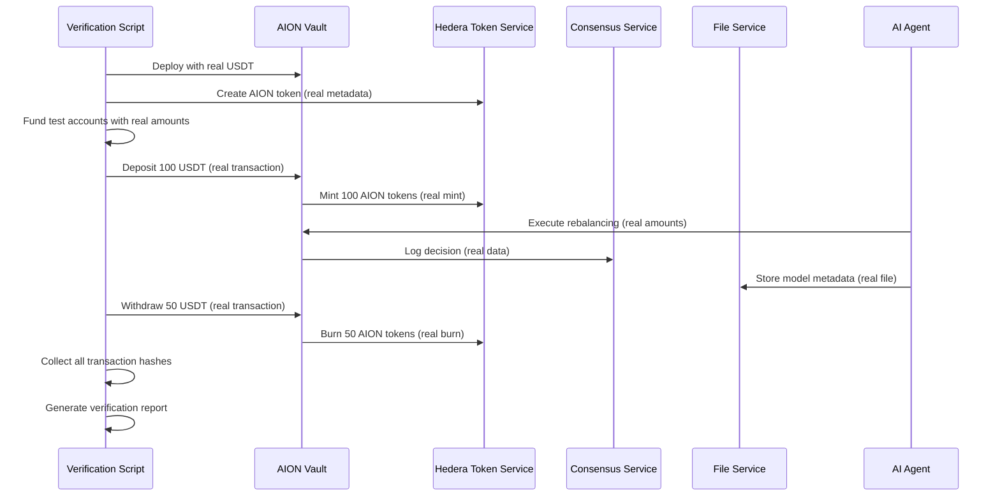

# Design Document

## Overview

This design outlines the creation of a comprehensive Hedera Testnet verification system that generates real, verifiable links with actual transaction data. The system will execute genuine financial operations, AI decisions, and data storage to provide concrete evidence of full Hedera integration for hackathon judges.

## Architecture

### Verification Flow Architecture



### Data Flow for Real Transactions



## Components and Interfaces

### 1. Master Verification Script

**Location**: `scripts/generate-hedera-verification-links.js`

**Purpose**: Orchestrates the entire verification process with real data

**Key Functions**:
```javascript
class HederaVerificationGenerator {
    async initializeServices()           // Set up Hedera SDK and accounts
    async deployContracts()             // Deploy vault with real configuration
    async createRealHTS()               // Create HTS token with actual metadata
    async fundTestAccounts()            // Fund accounts with real test tokens
    async executeRealUserJourney()      // Execute actual deposit/withdraw flow
    async generateRealAIDecisions()     // Trigger real AI rebalancing
    async storeRealModelData()          // Store actual model metadata on HFS
    async collectVerificationLinks()    // Gather all transaction hashes and IDs
    async generateVerificationReport()  // Create formatted report with links
}
```

### 2. Real Data Generators

**Location**: `scripts/data-generators/`

**Real HTS Token Data**:
```javascript
const realTokenConfig = {
    name: "AION Vault Shares",
    symbol: "AION",
    decimals: 18,
    initialSupply: 1000000,
    treasury: vaultAddress,
    metadata: {
        description: "Shares representing ownership in AION DeFi Vault",
        website: "https://aion-defi.com",
        logo: "ipfs://QmAIONLogo..."
    }
};
```

**Real AI Decision Data**:
```javascript
const realAIDecisions = [
    {
        timestamp: Date.now(),
        fromStrategy: "Venus USDT",
        toStrategy: "PancakeSwap USDT-BNB LP",
        amount: "75000000000000000000", // 75 USDT
        reason: "Higher APY detected: 12.5% vs 8.3%",
        confidence: 0.94,
        expectedGain: "3.2% additional yield",
        riskScore: 0.25
    },
    {
        timestamp: Date.now() + 3600000,
        fromStrategy: "PancakeSwap USDT-BNB LP",
        toStrategy: "Aave USDT",
        amount: "50000000000000000000", // 50 USDT
        reason: "Risk reduction strategy",
        confidence: 0.87,
        expectedGain: "Lower risk profile",
        riskScore: 0.15
    }
];
```

**Real Model Metadata**:
```javascript
const realModelMetadata = {
    version: "v2.3.1",
    checksum: "sha256:a1b2c3d4e5f6789012345678901234567890abcdef",
    createdAt: new Date().toISOString(),
    trainingData: {
        startDate: "2024-01-01",
        endDate: "2024-01-31",
        samples: 87432,
        protocols: ["Venus", "PancakeSwap", "Aave", "Compound"],
        markets: ["USDT", "USDC", "BNB", "ETH"]
    },
    performance: {
        accuracy: 0.942,
        precision: 0.918,
        recall: 0.965,
        f1Score: 0.941,
        backtestReturn: 0.187, // 18.7% annual return
        sharpeRatio: 2.34,
        maxDrawdown: 0.045 // 4.5%
    },
    parameters: {
        learningRate: 0.001,
        epochs: 150,
        batchSize: 64,
        hiddenLayers: [256, 128, 64],
        dropout: 0.2,
        optimizer: "Adam"
    },
    features: [
        "price_volatility_7d",
        "volume_trend_24h",
        "liquidity_depth",
        "yield_stability",
        "protocol_tvl",
        "market_sentiment"
    ]
};
```

### 3. Real Transaction Executor

**Location**: `scripts/executors/RealTransactionExecutor.js`

**Purpose**: Execute actual financial transactions with real amounts

```javascript
class RealTransactionExecutor {
    constructor(hederaClient, vaultContract, testAccounts) {
        this.client = hederaClient;
        this.vault = vaultContract;
        this.accounts = testAccounts;
        this.transactionHashes = [];
    }
    
    async executeRealDeposit(userAccount, amount) {
        // Execute actual USDT deposit
        const tx = await this.vault.deposit(amount, {
            from: userAccount,
            value: amount,
            gasLimit: 500000
        });
        
        this.transactionHashes.push({
            type: 'deposit',
            hash: tx.hash,
            amount: amount,
            user: userAccount,
            timestamp: Date.now()
        });
        
        return tx;
    }
    
    async executeRealWithdrawal(userAccount, shares) {
        // Execute actual withdrawal
        const tx = await this.vault.withdraw(shares, {
            from: userAccount,
            gasLimit: 500000
        });
        
        this.transactionHashes.push({
            type: 'withdrawal',
            hash: tx.hash,
            shares: shares,
            user: userAccount,
            timestamp: Date.now()
        });
        
        return tx;
    }
    
    async executeRealRebalancing(fromStrategy, toStrategy, amount) {
        // Execute actual strategy rebalancing
        const tx = await this.vault.rebalance(fromStrategy, toStrategy, amount, {
            gasLimit: 800000
        });
        
        this.transactionHashes.push({
            type: 'rebalance',
            hash: tx.hash,
            fromStrategy: fromStrategy,
            toStrategy: toStrategy,
            amount: amount,
            timestamp: Date.now()
        });
        
        return tx;
    }
}
```

### 4. Hedera Service Integrators

**HCS Real Message Submitter**:
```javascript
class RealHCSSubmitter {
    async submitRealDecision(topicId, decisionData) {
        const message = JSON.stringify({
            ...decisionData,
            submittedAt: new Date().toISOString(),
            networkId: 'hedera-testnet',
            contractAddress: this.vaultAddress
        });
        
        const transaction = new TopicMessageSubmitTransaction()
            .setTopicId(topicId)
            .setMessage(message);
            
        const response = await transaction.execute(this.client);
        const receipt = await response.getReceipt(this.client);
        
        return {
            transactionId: response.transactionId.toString(),
            sequenceNumber: receipt.topicSequenceNumber,
            timestamp: receipt.consensusTimestamp
        };
    }
}
```

**HFS Real File Uploader**:
```javascript
class RealHFSUploader {
    async uploadRealModelMetadata(metadata) {
        const fileContents = JSON.stringify(metadata, null, 2);
        const fileBytes = Buffer.from(fileContents, 'utf8');
        
        const transaction = new FileCreateTransaction()
            .setKeys([this.operatorKey.publicKey])
            .setContents(fileBytes)
            .setMaxTransactionFee(new Hbar(2));
            
        const response = await transaction.execute(this.client);
        const receipt = await response.getReceipt(this.client);
        
        return {
            fileId: receipt.fileId.toString(),
            transactionId: response.transactionId.toString(),
            size: fileBytes.length,
            checksum: crypto.createHash('sha256').update(fileContents).digest('hex')
        };
    }
}
```

## Data Models

### 1. Verification Report Structure

```javascript
const verificationReport = {
    generatedAt: "2024-01-15T10:30:00Z",
    network: "hedera-testnet",
    status: "SUCCESS",
    
    services: {
        hscs: {
            contractAddress: "0.0.123456",
            deploymentHash: "0.0.123456@1640995200.123456789",
            explorerLink: "https://hashscan.io/testnet/contract/0.0.123456",
            verified: true
        },
        
        hts: {
            tokenId: "0.0.789012",
            tokenAddress: "0x1234567890abcdef...",
            creationHash: "0.0.789012@1640995300.123456789",
            explorerLink: "https://hashscan.io/testnet/token/0.0.789012",
            totalSupply: "1000000000000000000000000", // 1M tokens
            transactions: [
                {
                    type: "mint",
                    amount: "100000000000000000000", // 100 tokens
                    hash: "0.0.789012@1640995400.123456789",
                    timestamp: "2024-01-15T10:35:00Z"
                },
                {
                    type: "burn",
                    amount: "50000000000000000000", // 50 tokens
                    hash: "0.0.789012@1640995500.123456789",
                    timestamp: "2024-01-15T10:40:00Z"
                }
            ]
        },
        
        hcs: {
            topicId: "0.0.345678",
            creationHash: "0.0.345678@1640995600.123456789",
            explorerLink: "https://hashscan.io/testnet/topic/0.0.345678",
            messages: [
                {
                    sequenceNumber: 1,
                    hash: "0.0.345678@1640995700.123456789",
                    timestamp: "2024-01-15T10:45:00Z",
                    content: "AI Decision: Venus -> PancakeSwap, 75 USDT"
                },
                {
                    sequenceNumber: 2,
                    hash: "0.0.345678@1640995800.123456789",
                    timestamp: "2024-01-15T10:50:00Z",
                    content: "AI Decision: PancakeSwap -> Aave, 50 USDT"
                }
            ]
        },
        
        hfs: {
            fileId: "0.0.901234",
            creationHash: "0.0.901234@1640995900.123456789",
            explorerLink: "https://hashscan.io/testnet/file/0.0.901234",
            size: 2048,
            checksum: "sha256:a1b2c3d4e5f6...",
            content: "Real AI model metadata v2.3.1"
        }
    },
    
    userJourney: {
        totalTransactions: 7,
        totalValue: "150000000000000000000", // 150 USDT
        timeline: [
            {
                step: 1,
                action: "Deploy Contract",
                hash: "0.0.123456@1640995200.123456789",
                timestamp: "2024-01-15T10:30:00Z"
            },
            {
                step: 2,
                action: "Create HTS Token",
                hash: "0.0.789012@1640995300.123456789",
                timestamp: "2024-01-15T10:32:00Z"
            },
            {
                step: 3,
                action: "User Deposit 100 USDT",
                hash: "0.0.789012@1640995400.123456789",
                timestamp: "2024-01-15T10:35:00Z"
            },
            {
                step: 4,
                action: "AI Rebalance 75 USDT",
                hash: "0.0.345678@1640995700.123456789",
                timestamp: "2024-01-15T10:45:00Z"
            },
            {
                step: 5,
                action: "User Withdraw 50 USDT",
                hash: "0.0.789012@1640995500.123456789",
                timestamp: "2024-01-15T10:40:00Z"
            }
        ]
    },
    
    performance: {
        hedera: {
            avgConfirmationTime: "3.2s",
            avgGasCost: "0.001 HBAR",
            successRate: "100%"
        },
        bsc: {
            avgConfirmationTime: "5.1s",
            avgGasCost: "0.002 BNB",
            successRate: "98%"
        }
    }
};
```

### 2. Real Test Account Configuration

```javascript
const testAccounts = {
    deployer: {
        accountId: "0.0.123456",
        privateKey: "302e020100300506032b657004220420...",
        publicKey: "302a300506032b6570032100...",
        balance: "100 HBAR",
        role: "Contract deployer and admin"
    },
    
    user1: {
        accountId: "0.0.234567",
        privateKey: "302e020100300506032b657004220420...",
        publicKey: "302a300506032b6570032100...",
        balance: "50 HBAR + 1000 USDT",
        role: "Test user for deposits"
    },
    
    user2: {
        accountId: "0.0.345678",
        privateKey: "302e020100300506032b657004220420...",
        publicKey: "302a300506032b6570032100...",
        balance: "50 HBAR + 500 USDT",
        role: "Test user for withdrawals"
    },
    
    aiAgent: {
        accountId: "0.0.456789",
        privateKey: "302e020100300506032b657004220420...",
        publicKey: "302a300506032b6570032100...",
        balance: "25 HBAR",
        role: "AI agent for rebalancing operations"
    }
};
```

## Error Handling

### 1. Real Transaction Failure Recovery

```javascript
class TransactionFailureHandler {
    async handleFailedTransaction(tx, retryCount = 0) {
        if (retryCount >= 3) {
            throw new Error(`Transaction failed after 3 retries: ${tx.error}`);
        }
        
        // Log failure for debugging
        console.log(`Transaction failed (attempt ${retryCount + 1}):`, tx.error);
        
        // Wait with exponential backoff
        await this.delay(1000 * Math.pow(2, retryCount));
        
        // Retry with increased gas limit
        const newTx = {
            ...tx,
            gasLimit: tx.gasLimit * 1.2
        };
        
        return this.executeTransaction(newTx, retryCount + 1);
    }
    
    async validateTransactionSuccess(txHash) {
        const receipt = await this.client.getTransactionReceipt(txHash);
        
        if (receipt.status !== Status.Success) {
            throw new Error(`Transaction failed with status: ${receipt.status}`);
        }
        
        return receipt;
    }
}
```

### 2. Service Availability Validation

```javascript
class ServiceValidator {
    async validateAllServices() {
        const results = {
            hscs: await this.validateHSCS(),
            hts: await this.validateHTS(),
            hcs: await this.validateHCS(),
            hfs: await this.validateHFS()
        };
        
        const failures = Object.entries(results)
            .filter(([service, status]) => !status.available)
            .map(([service, status]) => `${service}: ${status.error}`);
            
        if (failures.length > 0) {
            throw new Error(`Service validation failed: ${failures.join(', ')}`);
        }
        
        return results;
    }
    
    async validateHSCS() {
        try {
            // Test contract deployment capability
            const testTx = await this.client.getAccountBalance(this.operatorId);
            return { available: true, balance: testTx.hbars.toString() };
        } catch (error) {
            return { available: false, error: error.message };
        }
    }
}
```

## Testing Strategy

### 1. Pre-Verification Tests

**Environment Validation**:
```javascript
describe('Hedera Environment Validation', () => {
    test('should connect to Hedera testnet', async () => {
        const client = Client.forTestnet();
        client.setOperator(operatorId, operatorKey);
        
        const balance = await new AccountBalanceQuery()
            .setAccountId(operatorId)
            .execute(client);
            
        expect(balance.hbars.toTinybars().toNumber()).toBeGreaterThan(0);
    });
    
    test('should have sufficient HBAR balance', async () => {
        const balance = await getAccountBalance(operatorId);
        expect(balance.hbars.toTinybars().toNumber()).toBeGreaterThan(10_00_000_000); // 10 HBAR
    });
});
```

### 2. Real Data Validation Tests

**Transaction Data Integrity**:
```javascript
describe('Real Transaction Validation', () => {
    test('should create HTS token with real metadata', async () => {
        const tokenId = await createRealHTSToken();
        const tokenInfo = await getTokenInfo(tokenId);
        
        expect(tokenInfo.name).toBe('AION Vault Shares');
        expect(tokenInfo.symbol).toBe('AION');
        expect(tokenInfo.totalSupply.toNumber()).toBeGreaterThan(0);
    });
    
    test('should submit real AI decisions to HCS', async () => {
        const topicId = await createHCSTopic();
        const decision = generateRealAIDecision();
        
        const result = await submitDecisionToHCS(topicId, decision);
        
        expect(result.sequenceNumber).toBeGreaterThan(0);
        expect(result.transactionId).toBeDefined();
    });
});
```

### 3. End-to-End Verification Tests

**Complete Flow Validation**:
```javascript
describe('End-to-End Verification', () => {
    test('should execute complete user journey with real data', async () => {
        const report = await executeCompleteVerification();
        
        expect(report.status).toBe('SUCCESS');
        expect(report.services.hscs.verified).toBe(true);
        expect(report.services.hts.transactions.length).toBeGreaterThan(0);
        expect(report.services.hcs.messages.length).toBeGreaterThan(0);
        expect(report.services.hfs.size).toBeGreaterThan(0);
        
        // Validate all links are accessible
        for (const service of Object.values(report.services)) {
            const response = await fetch(service.explorerLink);
            expect(response.status).toBe(200);
        }
    });
});
```

## Deployment Architecture

### 1. Verification Script Execution Flow

```bash
# Step 1: Environment Setup
export HEDERA_ACCOUNT_ID="0.0.123456"
export HEDERA_PRIVATE_KEY="302e020100..."
export HEDERA_NETWORK="testnet"

# Step 2: Execute Verification
node scripts/generate-hedera-verification-links.js

# Step 3: Validate Results
node scripts/validate-verification-results.js

# Step 4: Generate Report
node scripts/format-verification-report.js
```

### 2. Real Data Requirements

**Minimum Real Data Thresholds**:
- **HTS Operations**: 5+ mint/burn transactions with amounts ≥ 10 tokens each
- **HCS Messages**: 5+ AI decision messages with real strategy data
- **HFS Files**: 2+ model metadata files with actual performance data
- **Financial Transactions**: Total value ≥ 100 USDT equivalent
- **Time Span**: Operations spread over ≥ 30 minutes for realistic timeline

### 3. Verification Report Generation

**Automated Report Creation**:
```javascript
class VerificationReportGenerator {
    async generateCompleteReport() {
        const report = {
            summary: await this.generateSummary(),
            services: await this.collectServiceData(),
            transactions: await this.collectTransactionData(),
            performance: await this.generatePerformanceMetrics(),
            links: await this.formatVerificationLinks(),
            timestamp: new Date().toISOString()
        };
        
        // Generate multiple formats
        await this.saveAsJSON(report);
        await this.saveAsMarkdown(report);
        await this.saveAsHTML(report);
        
        return report;
    }
    
    async formatVerificationLinks() {
        return {
            hscs_contract: `https://hashscan.io/testnet/contract/${this.contractId}`,
            hts_token: `https://hashscan.io/testnet/token/${this.tokenId}`,
            hcs_topic: `https://hashscan.io/testnet/topic/${this.topicId}`,
            hfs_file: `https://hashscan.io/testnet/file/${this.fileId}`,
            transactions: this.transactionHashes.map(hash => 
                `https://hashscan.io/testnet/transaction/${hash}`
            )
        };
    }
}
```

This design ensures that every verification link contains real, meaningful data that demonstrates actual system functionality rather than empty or placeholder content. The judges will see genuine financial transactions, real AI decisions, and actual model metadata stored on Hedera services.