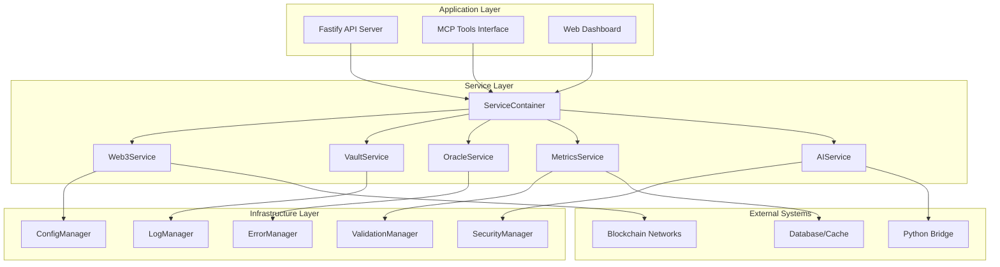
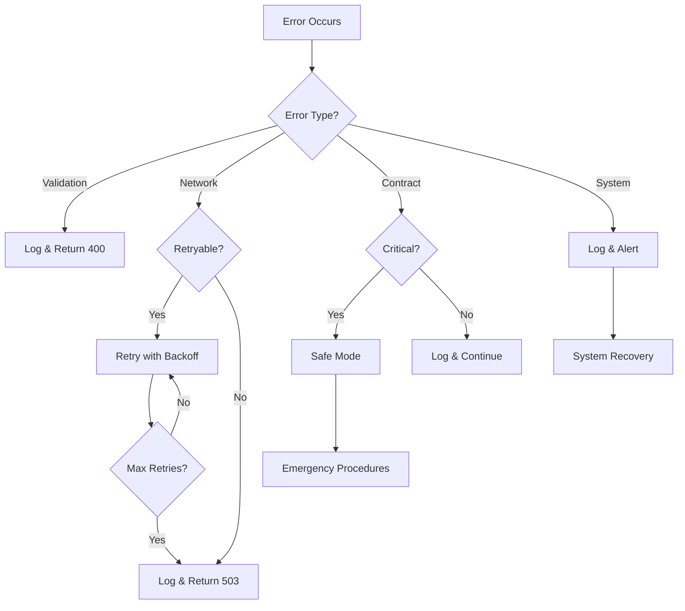

# Design Document - MCP Agent Code Quality Improvements

## Overview

This design document outlines the technical approach for improving the AION AI Agent MCP integration. The improvements focus on transforming the current functional but problematic codebase into a production-ready, secure, and maintainable system. The design addresses critical issues identified in the code review while maintaining backward compatibility and system functionality.

## Architecture

### Current Architecture Issues

The current system suffers from:
- Mixed module systems (CommonJS + ES6)
- Global state management with tight coupling
- Inconsistent error handling
- Security vulnerabilities
- Performance bottlenecks

### Proposed Architecture



## Components and Interfaces

### 1. Service Container (Dependency Injection)

**Purpose:** Centralized service management and dependency injection

```typescript
interface IServiceContainer {
  register<T>(name: string, factory: () => T): void;
  get<T>(name: string): T;
  initialize(): Promise<void>;
  shutdown(): Promise<void>;
}

class ServiceContainer implements IServiceContainer {
  private services: Map<string, any>;
  private factories: Map<string, () => any>;
  private initialized: Set<string>;
}
```

### 2. Configuration Manager

**Purpose:** Centralized configuration with validation and environment support

```typescript
interface IConfigManager {
  get<T>(key: string): T;
  validate(): boolean;
  reload(): Promise<void>;
}

class ConfigManager implements IConfigManager {
  private config: Map<string, any>;
  private schema: JSONSchema;
  private environment: string;
}
```

### 3. Enhanced Error Manager

**Purpose:** Comprehensive error handling with categorization and recovery

```typescript
interface IErrorManager {
  handleError(error: Error, context: ErrorContext): Promise<void>;
  registerHandler(type: string, handler: ErrorHandler): void;
  getErrorStats(): ErrorStats;
}

enum ErrorType {
  VALIDATION = 'validation',
  NETWORK = 'network',
  CONTRACT = 'contract',
  SYSTEM = 'system'
}

class ErrorManager implements IErrorManager {
  private handlers: Map<string, ErrorHandler>;
  private stats: ErrorStats;
  private logger: ILogger;
}
```

### 4. Validation Manager

**Purpose:** Comprehensive input validation and sanitization

```typescript
interface IValidationManager {
  validateAddress(address: string): ValidationResult;
  validateAmount(amount: string | number): ValidationResult;
  sanitizeInput(input: any, schema: JSONSchema): any;
}

class ValidationManager implements IValidationManager {
  private schemas: Map<string, JSONSchema>;
  private sanitizers: Map<string, Sanitizer>;
}
```

### 5. Security Manager

**Purpose:** Security operations including key management and authentication

```typescript
interface ISecurityManager {
  getPrivateKey(): Promise<string>;
  validateRequest(request: Request): Promise<boolean>;
  encryptSensitiveData(data: string): string;
  decryptSensitiveData(encryptedData: string): string;
}

class SecurityManager implements ISecurityManager {
  private keyProvider: IKeyProvider;
  private encryptionService: IEncryptionService;
}
```

### 6. Enhanced Web3 Service

**Purpose:** Improved blockchain interactions with retry logic and gas optimization

```typescript
interface IWeb3Service {
  estimateGas(transaction: Transaction): Promise<bigint>;
  executeWithRetry<T>(operation: () => Promise<T>): Promise<T>;
  getOptimalGasPrice(network: string): Promise<bigint>;
  healthCheck(network: string): Promise<boolean>;
}

class Web3Service implements IWeb3Service {
  private providers: Map<string, Provider>;
  private signers: Map<string, Signer>;
  private retryConfig: RetryConfig;
  private gasOptimizer: IGasOptimizer;
}
```

### 7. Python Bridge Enhancement

**Purpose:** Robust Python integration with comprehensive validation

```typescript
interface IPythonBridge {
  execute(operation: string, params: any): Promise<BridgeResult>;
  validateInput(params: any, schema: JSONSchema): ValidationResult;
  healthCheck(): Promise<boolean>;
}

class PythonBridge implements IPythonBridge {
  private validator: IValidationManager;
  private processManager: IProcessManager;
  private timeout: number;
}
```

## Data Models

### 1. Service Configuration

```typescript
interface ServiceConfig {
  name: string;
  enabled: boolean;
  dependencies: string[];
  config: Record<string, any>;
  healthCheck?: () => Promise<boolean>;
}
```

### 2. Error Context

```typescript
interface ErrorContext {
  service: string;
  operation: string;
  userId?: string;
  requestId: string;
  timestamp: Date;
  metadata: Record<string, any>;
}
```

### 3. Validation Result

```typescript
interface ValidationResult {
  isValid: boolean;
  errors: ValidationError[];
  sanitizedValue?: any;
}

interface ValidationError {
  field: string;
  message: string;
  code: string;
}
```

### 4. Bridge Result

```typescript
interface BridgeResult {
  success: boolean;
  data?: any;
  error?: string;
  executionTime: number;
  metadata: Record<string, any>;
}
```

### 5. Retry Configuration

```typescript
interface RetryConfig {
  maxAttempts: number;
  baseDelay: number;
  maxDelay: number;
  backoffMultiplier: number;
  retryableErrors: string[];
}
```

## Error Handling

### Error Categories

1. **Validation Errors**: Input validation failures
2. **Network Errors**: Blockchain network issues
3. **Contract Errors**: Smart contract interaction failures
4. **System Errors**: Internal system failures

### Error Handling Strategy



### Recovery Mechanisms

1. **Automatic Retry**: For transient network issues
2. **Circuit Breaker**: For persistent service failures
3. **Safe Mode**: For critical contract failures
4. **Graceful Degradation**: For non-critical service failures

## Testing Strategy

### 1. Unit Testing

- **Coverage Target**: 90%+
- **Framework**: Jest with ES6 module support
- **Mocking**: Service dependencies and external calls
- **Focus Areas**: Business logic, validation, error handling

### 2. Integration Testing

- **Environment**: Dedicated test environment with mock services
- **Scope**: Service interactions, API endpoints, database operations
- **Data**: Test fixtures and factories for consistent test data

### 3. Performance Testing

- **Load Testing**: Concurrent user scenarios
- **Stress Testing**: System limits and breaking points
- **Memory Testing**: Memory leaks and garbage collection
- **Gas Testing**: Smart contract gas optimization validation

### 4. Security Testing

- **Input Validation**: Malicious input scenarios
- **Authentication**: Access control validation
- **Encryption**: Data protection verification
- **Vulnerability Scanning**: Automated security scans

## Security Considerations

### 1. Key Management

- **Development**: Local encrypted key files
- **Production**: Hardware Security Modules (HSM) or cloud key management
- **Rotation**: Automated key rotation procedures
- **Access**: Role-based access control

### 2. Input Validation

- **Schema Validation**: JSON Schema for all inputs
- **Sanitization**: XSS and injection prevention
- **Rate Limiting**: Per-user and per-endpoint limits
- **Authentication**: JWT tokens with proper validation

### 3. Data Protection

- **Encryption**: AES-256 for sensitive data at rest
- **Transport**: TLS 1.3 for all communications
- **Logging**: Sensitive data exclusion from logs
- **Audit**: Comprehensive audit trails

## Performance Optimizations

### 1. Connection Management

```typescript
interface IConnectionPool {
  getConnection(network: string): Promise<Connection>;
  releaseConnection(connection: Connection): void;
  healthCheck(): Promise<PoolHealth>;
}

class ConnectionPool implements IConnectionPool {
  private pools: Map<string, Pool>;
  private config: PoolConfig;
}
```

### 2. Caching Strategy

```typescript
interface ICacheManager {
  get<T>(key: string): Promise<T | null>;
  set<T>(key: string, value: T, ttl?: number): Promise<void>;
  invalidate(pattern: string): Promise<void>;
}

class CacheManager implements ICacheManager {
  private redis: RedisClient;
  private localCache: Map<string, CacheEntry>;
  private config: CacheConfig;
}
```

### 3. Request Queue Management

```typescript
interface IQueueManager {
  enqueue(request: QueuedRequest): Promise<string>;
  process(): Promise<void>;
  getStatus(requestId: string): Promise<QueueStatus>;
}

class QueueManager implements IQueueManager {
  private queue: Queue<QueuedRequest>;
  private workers: Worker[];
  private config: QueueConfig;
}
```

## Monitoring and Observability

### 1. Metrics Collection

- **System Metrics**: CPU, memory, disk usage
- **Application Metrics**: Request rates, response times, error rates
- **Business Metrics**: Transaction volumes, user activity, yield generation
- **Custom Metrics**: Service-specific performance indicators

### 2. Logging Strategy

```typescript
interface ILogger {
  info(message: string, metadata?: any): void;
  warn(message: string, metadata?: any): void;
  error(message: string, error?: Error, metadata?: any): void;
  debug(message: string, metadata?: any): void;
}

class Logger implements ILogger {
  private winston: WinstonLogger;
  private context: LogContext;
  private filters: LogFilter[];
}
```

### 3. Health Checks

```typescript
interface IHealthCheck {
  name: string;
  check(): Promise<HealthStatus>;
  dependencies: string[];
}

interface HealthStatus {
  healthy: boolean;
  message?: string;
  details?: Record<string, any>;
  timestamp: Date;
}
```

## Deployment Considerations

### 1. Environment Configuration

- **Development**: Local development with mock services
- **Testing**: Automated testing environment
- **Staging**: Production-like environment for final validation
- **Production**: High-availability production deployment

### 2. Migration Strategy

1. **Phase 1**: Infrastructure improvements (DI, error handling)
2. **Phase 2**: Security enhancements (key management, validation)
3. **Phase 3**: Performance optimizations (caching, pooling)
4. **Phase 4**: Testing and monitoring improvements

### 3. Rollback Plan

- **Database Migrations**: Reversible migration scripts
- **Configuration Changes**: Version-controlled configuration
- **Service Updates**: Blue-green deployment strategy
- **Monitoring**: Real-time health monitoring during deployment

## Success Criteria

### Technical Metrics

- **Reliability**: 99.9% uptime
- **Performance**: <200ms API response time
- **Security**: Zero critical vulnerabilities
- **Quality**: 90%+ test coverage

### Operational Metrics

- **Error Rate**: <0.1% for critical operations
- **Recovery Time**: <5 minutes for service failures
- **Deployment Time**: <10 minutes for updates
- **Monitoring Coverage**: 100% of critical components

This design provides a comprehensive roadmap for transforming the MCP Agent into a production-ready, secure, and maintainable system while addressing all identified issues from the code review.