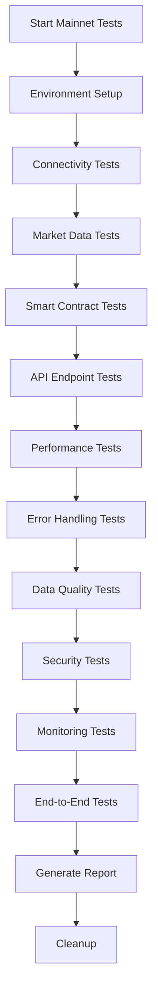

# MCP Agent Mainnet Testing Design

## Overview

This design document outlines a comprehensive testing framework for validating the AION MCP Agent against BSC mainnet with real data sources. The testing framework will ensure all functions work correctly with live blockchain data, external APIs, and real smart contracts.

## Architecture

### Testing Framework Structure

```
mcp_agent/tests/mainnet/
├── connectivity/           # Network and RPC testing
├── market-data/           # Real market data validation
├── smart-contracts/       # Contract interaction testing
├── api-endpoints/         # API functionality testing
├── performance/           # Load and performance testing
├── error-handling/        # Error scenarios and recovery
├── data-quality/          # Data validation and consistency
├── security/              # Security and validation testing
├── monitoring/            # Metrics and monitoring testing
└── end-to-end/           # Complete workflow testing
```

### Test Execution Pipeline



## Components and Interfaces

### 1. Test Configuration Manager

**Purpose:** Centralized configuration for mainnet testing
**Interface:**
```javascript
class MainnetTestConfig {
  constructor(environment = 'mainnet')
  getNetworkConfig(network)
  getContractAddresses(network)
  getAPIEndpoints()
  getPerformanceThresholds()
  getSecuritySettings()
}
```

### 2. Real Data Validator

**Purpose:** Validate data quality and consistency from live sources
**Interface:**
```javascript
class RealDataValidator {
  validatePriceData(priceData)
  validateProtocolData(protocolData)
  validateContractData(contractData)
  validateTimestamps(data)
  validateDataRanges(data)
}
```

### 3. Performance Monitor

**Purpose:** Track performance metrics during testing
**Interface:**
```javascript
class PerformanceMonitor {
  startMonitoring()
  recordMetric(name, value, timestamp)
  getMetrics()
  generateReport()
  checkThresholds()
}
```

### 4. Error Scenario Simulator

**Purpose:** Simulate various error conditions for testing
**Interface:**
```javascript
class ErrorScenarioSimulator {
  simulateNetworkFailure()
  simulateAPIRateLimit()
  simulateContractFailure()
  simulateHighLoad()
  restoreNormalOperation()
}
```

## Data Models

### Test Result Model
```javascript
{
  testSuite: string,
  testName: string,
  status: 'passed' | 'failed' | 'skipped',
  duration: number,
  timestamp: string,
  metrics: {
    responseTime: number,
    memoryUsage: number,
    cpuUsage: number
  },
  data: {
    input: any,
    output: any,
    expected: any
  },
  errors: string[],
  warnings: string[]
}
```

### Network Health Model
```javascript
{
  network: string,
  rpcEndpoint: string,
  status: 'connected' | 'disconnected' | 'degraded',
  blockNumber: bigint,
  gasPrice: bigint,
  responseTime: number,
  lastChecked: string
}
```

### Market Data Model
```javascript
{
  source: string,
  timestamp: string,
  bnbPrice: number,
  protocols: {
    [protocolName]: {
      apy: number,
      tvl: number,
      health: string,
      source: string,
      lastUpdated: string
    }
  },
  stale: boolean
}
```

## Error Handling

### Network Error Handling
- **Connection Failures:** Implement retry logic with exponential backoff
- **Timeout Handling:** Set appropriate timeouts for different operations
- **Failover Logic:** Switch between multiple RPC endpoints
- **Circuit Breaker:** Prevent cascading failures

### API Error Handling
- **Rate Limiting:** Implement proper backoff strategies
- **Invalid Responses:** Validate and sanitize all API responses
- **Service Unavailability:** Graceful degradation with cached data
- **Authentication Errors:** Proper error reporting and recovery

### Data Validation Errors
- **Invalid Data Types:** Type checking and conversion
- **Out of Range Values:** Range validation for all numeric data
- **Missing Fields:** Handle incomplete data gracefully
- **Stale Data:** Flag and handle expired data appropriately

## Testing Strategy

### 1. Connectivity Testing
**Objective:** Ensure reliable connection to BSC mainnet
**Tests:**
- RPC endpoint connectivity
- Block number retrieval
- Gas price fetching
- Network switching
- Connection pooling
- Failover mechanisms

### 2. Market Data Testing
**Objective:** Validate real-time market data integration
**Tests:**
- Binance API integration
- DeFiLlama protocol data
- Venus protocol metrics
- PancakeSwap DEX data
- Beefy vault performance
- Data freshness validation
- Cache behavior testing

### 3. Smart Contract Testing
**Objective:** Ensure proper contract interaction
**Tests:**
- Contract state reading
- Gas estimation accuracy
- Transaction simulation
- Balance checking
- Venus contract integration
- Error handling for failed calls

### 4. API Endpoint Testing
**Objective:** Validate all REST API endpoints
**Tests:**
- Health check endpoint
- Oracle snapshot endpoint
- Historical data endpoint
- Vault stats endpoint
- Execute endpoint
- Decision endpoint
- Transaction history endpoint

### 5. Performance Testing
**Objective:** Ensure system performs under load
**Tests:**
- Concurrent request handling
- Sustained load testing
- Cache performance
- Memory usage monitoring
- Response time validation
- Throughput measurement

### 6. Error Handling Testing
**Objective:** Validate error scenarios and recovery
**Tests:**
- Network failure simulation
- API rate limit handling
- Invalid input handling
- Service failure recovery
- Timeout scenarios
- Data corruption handling

### 7. Data Quality Testing
**Objective:** Ensure data accuracy and consistency
**Tests:**
- Price data validation
- APY range checking
- TVL validation
- Timestamp verification
- Protocol health status
- Data consistency across calls

### 8. Security Testing
**Objective:** Validate security measures
**Tests:**
- Input sanitization
- Rate limiting effectiveness
- SSL certificate validation
- Private key protection
- Error message sanitization
- Authentication mechanisms

### 9. Monitoring Testing
**Objective:** Ensure proper metrics collection
**Tests:**
- Performance metrics collection
- Health status reporting
- Error counting
- Cache metrics
- Resource usage tracking
- Alert generation

### 10. End-to-End Testing
**Objective:** Validate complete user workflows
**Tests:**
- Full data pipeline execution
- Multi-protocol data aggregation
- Concurrent user simulation
- Real user scenario testing
- System stability under load
- Recovery after failures

## Implementation Details

### Test Environment Setup
```javascript
// Environment configuration for mainnet testing
const MAINNET_CONFIG = {
  networks: {
    bscMainnet: {
      rpcUrls: [
        'https://bsc-dataseed1.binance.org',
        'https://bsc-dataseed2.binance.org',
        'https://bsc-dataseed3.binance.org'
      ],
      chainId: 56,
      contracts: {
        vault: '0xB176c1FA7B3feC56cB23681B6E447A7AE60C5254',
        venus: '0xfD36E2c2a6789Db23113685031d7F16329158384'
      }
    }
  },
  apis: {
    binance: 'https://api.binance.com/api/v3',
    defillama: 'https://api.llama.fi',
    venus: 'https://api.venus.io/api'
  },
  thresholds: {
    responseTime: 2000,
    successRate: 0.95,
    cacheHitRatio: 0.8
  }
};
```

### Test Data Validation
```javascript
// Data validation rules for mainnet testing
const VALIDATION_RULES = {
  bnbPrice: {
    min: 100,
    max: 10000,
    type: 'number'
  },
  apy: {
    min: 0,
    max: 1000,
    type: 'number'
  },
  tvl: {
    min: 100000,
    type: 'number'
  },
  timestamp: {
    maxAge: 300000, // 5 minutes
    format: 'ISO'
  }
};
```

### Performance Monitoring
```javascript
// Performance monitoring configuration
const PERFORMANCE_CONFIG = {
  metrics: [
    'responseTime',
    'memoryUsage',
    'cpuUsage',
    'cacheHitRatio',
    'errorRate',
    'throughput'
  ],
  intervals: {
    collection: 1000,
    reporting: 30000
  },
  alerts: {
    responseTime: 5000,
    errorRate: 0.1,
    memoryUsage: 0.8
  }
};
```

## Test Execution Flow

### 1. Pre-Test Setup
- Initialize test environment
- Configure network connections
- Set up monitoring
- Prepare test data
- Validate prerequisites

### 2. Test Execution
- Run connectivity tests
- Execute market data tests
- Perform contract tests
- Validate API endpoints
- Conduct performance tests
- Test error scenarios
- Validate data quality
- Check security measures
- Monitor system metrics
- Run end-to-end tests

### 3. Post-Test Analysis
- Collect all metrics
- Generate test reports
- Analyze performance data
- Identify issues
- Create recommendations
- Clean up resources

## Success Criteria

### Functional Requirements
- All API endpoints return valid responses
- Real data is fetched from live sources
- Contract interactions work correctly
- Error handling functions properly
- Data validation passes all checks

### Performance Requirements
- Response times under 2 seconds for 95% of requests
- System handles 100 concurrent users
- Cache hit ratio above 80%
- Memory usage stays below 80%
- Success rate above 95%

### Quality Requirements
- All price data within market ranges
- Protocol data matches external sources
- Timestamps are recent and valid
- Data consistency across multiple calls
- No data corruption or loss

## Risk Mitigation

### Network Risks
- **Risk:** RPC endpoint failures
- **Mitigation:** Multiple backup endpoints and automatic failover

### API Risks
- **Risk:** External API rate limiting
- **Mitigation:** Implement proper backoff and caching strategies

### Performance Risks
- **Risk:** System overload during testing
- **Mitigation:** Gradual load increase and monitoring

### Data Risks
- **Risk:** Invalid or corrupted data
- **Mitigation:** Comprehensive validation and sanitization

### Security Risks
- **Risk:** Exposure of sensitive data
- **Mitigation:** Proper input validation and error handling