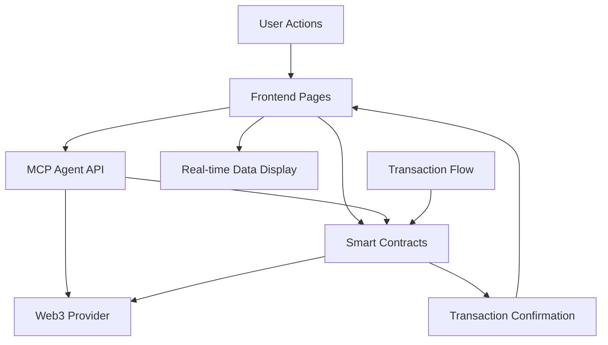

# Design Document

## Overview

This design outlines a systematic approach to clean up, optimize, and fully integrate the AION project for a professional hackathon demo. The approach involves four main phases: codebase analysis and cleanup, frontend integration verification, end-to-end testing, and final optimization. The design ensures that all components work with real data and provide a seamless user experience.

## Architecture

### Phase-Based Approach

The cleanup and optimization will follow a structured four-phase approach:

1. **Discovery and Cleanup Phase**: Identify and remove unused files, convert comments, eliminate redundancies
2. **Integration Verification Phase**: Ensure all frontend components use real data from contracts and MCP agent
3. **User Flow Testing Phase**: Test complete user journeys and fix any issues
4. **Optimization and Polish Phase**: Performance tuning and UI polish for demo readiness

### System Integration Points



## Components and Interfaces

### 1. File System Cleanup Component

**Purpose**: Systematically scan and clean the entire project structure

**Key Functions**:
- Unused file detection and removal
- Comment language conversion (Arabic to English)
- Redundant file elimination
- Dead code removal

**Integration Points**:
- All project directories and subdirectories
- All source code files (.js, .ts, .tsx, .sol, .md)
- Configuration and build files

### 2. Frontend Integration Validator

**Purpose**: Ensure all frontend components use real data sources

**Key Functions**:
- Mock data detection and replacement
- API integration verification
- Contract interaction validation
- Transaction flow testing

**Integration Points**:
- React components and pages
- Custom hooks and services
- API client configurations
- Web3 contract interfaces

### 3. User Flow Testing Engine

**Purpose**: Validate complete user journeys from start to finish

**Key Functions**:
- Page navigation testing
- Form submission validation
- Transaction execution testing
- Data consistency verification

**Integration Points**:
- All frontend pages and components
- Backend API endpoints
- Smart contract functions
- User state management

### 4. Performance Optimization Module

**Purpose**: Ensure fast loading and error-free operation

**Key Functions**:
- Performance bottleneck identification
- Console error elimination
- UI polish and consistency
- Demo readiness validation

**Integration Points**:
- Build and bundling processes
- Runtime performance monitoring
- Error tracking and logging
- UI component library

## Data Models

### Cleanup Report Model
```typescript
interface CleanupReport {
  filesRemoved: string[];
  commentsConverted: number;
  deadCodeRemoved: string[];
  redundantFilesEliminated: string[];
  totalSizeReduction: number;
}
```

### Integration Status Model
```typescript
interface IntegrationStatus {
  pageId: string;
  componentsChecked: number;
  mockDataReplaced: number;
  apiIntegrationsVerified: number;
  transactionFlowsValidated: number;
  status: 'pending' | 'in-progress' | 'completed' | 'failed';
  issues: string[];
}
```

### User Flow Test Model
```typescript
interface UserFlowTest {
  flowId: string;
  steps: FlowStep[];
  status: 'passed' | 'failed' | 'partial';
  executionTime: number;
  errors: string[];
  dataConsistency: boolean;
}

interface FlowStep {
  stepId: string;
  action: string;
  expectedResult: string;
  actualResult: string;
  passed: boolean;
}
```

### Performance Metrics Model
```typescript
interface PerformanceMetrics {
  pageLoadTimes: Record<string, number>;
  bundleSize: number;
  consoleErrors: string[];
  consoleWarnings: string[];
  memoryUsage: number;
  renderTime: number;
}
```

## Error Handling

### File System Operations
- Handle permission errors gracefully
- Provide rollback capability for file deletions
- Validate file integrity before modifications
- Create backups of critical files before changes

### Integration Testing
- Catch and report API connection failures
- Handle contract interaction errors
- Provide fallback mechanisms for failed integrations
- Log detailed error information for debugging

### User Flow Testing
- Continue testing even when individual steps fail
- Provide detailed failure reports
- Allow partial flow completion
- Support test retry mechanisms

### Performance Optimization
- Handle build failures gracefully
- Provide performance degradation warnings
- Support incremental optimization
- Maintain functionality during optimization

## Testing Strategy

### 1. Automated File Scanning
- Recursive directory traversal
- Pattern matching for unused imports/exports
- Dead code detection algorithms
- Comment language detection

### 2. Integration Testing Suite
- API endpoint validation
- Contract function call testing
- Data flow verification
- Transaction simulation

### 3. End-to-End User Flow Testing
- Automated browser testing
- Real user scenario simulation
- Cross-page navigation testing
- State persistence validation

### 4. Performance Testing
- Page load time measurement
- Bundle size analysis
- Memory leak detection
- Runtime performance profiling

## Implementation Phases

### Phase 1: Discovery and Analysis (Estimated: 2-3 hours)
- Scan entire project structure
- Identify unused files and components
- Catalog Arabic comments for conversion
- Generate cleanup plan

### Phase 2: Cleanup Execution (Estimated: 3-4 hours)
- Remove unused files and dead code
- Convert all Arabic comments to English
- Eliminate redundant components
- Verify no functionality is broken

### Phase 3: Integration Verification (Estimated: 4-5 hours)
- Review all frontend pages and components
- Replace mock data with real API calls
- Verify contract integrations
- Test transaction flows

### Phase 4: User Flow Testing (Estimated: 2-3 hours)
- Design comprehensive user journey tests
- Execute end-to-end testing scenarios
- Fix identified issues
- Validate data consistency

### Phase 5: Final Optimization (Estimated: 2-3 hours)
- Performance tuning and optimization
- UI polish and consistency improvements
- Console error elimination
- Demo readiness validation

## Success Criteria

### Technical Success Metrics
- Zero unused files remaining in project
- All comments converted to professional English
- All frontend components using real data
- Complete user flows working without errors
- Page load times under 2 seconds
- Zero console errors or warnings

### User Experience Success Metrics
- Seamless navigation between all pages
- All buttons and forms functional with real data
- Transactions execute successfully
- Real-time data updates working
- Professional UI appearance suitable for demo

### Integration Success Metrics
- Smart contracts properly connected to frontend
- MCP agent responding to all API calls
- Data consistency across all components
- Error handling working correctly
- Transaction confirmations displaying properly