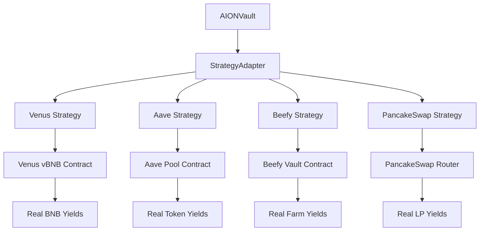

# Design Document - Real Strategy Integration

## Overview

This design document outlines the transformation of AION Vault strategies from simulation mode to production-ready integrations that generate real yields from established DeFi protocols on BNB Chain. The current implementation uses mock data and simulated yields, which needs to be replaced with actual protocol interactions.

## Architecture

### Current State Analysis

The existing strategy contracts follow a consistent pattern but lack real protocol integration:

1. **Simulation Mode**: All strategies currently simulate yields using fixed APY rates
2. **Mock Interactions**: Protocol-specific functions are commented out with TODO markers
3. **Test-Only Functionality**: Real protocol calls are bypassed for testing convenience

### Target Architecture



## Components and Interfaces

### 1. Venus Protocol Integration

**Current Implementation Issues:**
- `vbnb.mint()` calls are commented out
- `vbnb.redeemUnderlying()` calls are bypassed
- `balanceOfUnderlying()` not used for real balance calculation

**Required Changes:**
```solidity
// Real Venus integration
function deposit(address user, uint256 amount) external payable override onlyVault notPaused {
    require(amount > 0, "Zero deposit");
    require(msg.value == amount, "msg.value mismatch");
    
    // Real Venus integration
    try vbnb.mint{value: amount}() {
        principal[user] += amount;
        totalPrincipal += amount;
        emit Deposited(user, amount);
    } catch Error(string memory reason) {
        emit VenusError(reason);
        revert("Venus deposit failed");
    }
}
```

### 2. Aave Protocol Integration

**Current Implementation Issues:**
- `aavePool.supply()` calls are commented out
- `aToken.balanceOf()` not used for real balance tracking
- No real APY calculation from Aave rates

**Required Changes:**
```solidity
function deposit(address user, uint256 amount) external payable override onlyVault notPaused {
    require(amount > 0, "Zero deposit");
    
    underlyingToken.safeTransferFrom(msg.sender, address(this), amount);
    underlyingToken.approve(address(aavePool), amount);
    
    try aavePool.supply(address(underlyingToken), amount, address(this), 0) {
        principal[user] += amount;
        totalPrincipal += amount;
        emit Deposited(user, amount);
    } catch Error(string memory reason) {
        emit AaveError(reason);
        revert("Aave deposit failed");
    }
}
```

### 3. Multi-Strategy Yield Comparison

**Real-time APY Fetching:**
```solidity
interface IYieldOracle {
    function getVenusAPY() external view returns (uint256);
    function getAaveAPY() external view returns (uint256);
    function getBeefyAPY(address vault) external view returns (uint256);
    function getPancakeAPY(address pair) external view returns (uint256);
}
```

### 4. Error Handling and Fallbacks

**Protocol Failure Handling:**
```solidity
modifier withProtocolFallback() {
    try this.executeStrategy() {
        _;
    } catch {
        // Fallback to safe mode
        _enterSafeMode();
        emit ProtocolFailure(address(this));
    }
}
```

## Data Models

### Strategy State Model

```solidity
struct StrategyState {
    bool isActive;
    bool inSafeMode;
    uint256 totalDeposited;
    uint256 totalYieldGenerated;
    uint256 lastUpdateTimestamp;
    address protocolAddress;
    uint256 currentAPY;
}
```

### User Position Model

```solidity
struct UserPosition {
    uint256 principal;
    uint256 yieldAccrued;
    uint256 lastYieldUpdate;
    uint256 depositTimestamp;
    bool isActive;
}
```

### Protocol Integration Model

```solidity
struct ProtocolIntegration {
    address protocolContract;
    bytes4[] supportedFunctions;
    uint256 minDeposit;
    uint256 maxDeposit;
    uint256 withdrawalFee;
    bool isHealthy;
}
```

## Error Handling

### 1. Protocol Failure Scenarios

**Venus Protocol Failures:**
- Network congestion causing transaction failures
- Venus contract upgrades or maintenance
- Insufficient liquidity for withdrawals

**Handling Strategy:**
```solidity
function handleVenusFailure() internal {
    // 1. Stop new deposits
    _pause();
    
    // 2. Enable emergency withdrawals
    _enableEmergencyMode();
    
    // 3. Notify users
    emit ProtocolEmergency("Venus", "Service temporarily unavailable");
    
    // 4. Switch to backup strategy if available
    if (hasBackupStrategy) {
        _switchToBackupStrategy();
    }
}
```

### 2. Yield Calculation Failures

**Fallback Mechanisms:**
- Use cached APY data when live data unavailable
- Implement circuit breakers for abnormal yield rates
- Provide conservative estimates during uncertainty

### 3. Gas Optimization Failures

**Adaptive Gas Management:**
```solidity
function adaptiveGasExecution(bytes calldata data) internal {
    uint256 gasLimit = gasleft();
    
    if (gasLimit < MIN_GAS_REQUIRED) {
        // Queue for later execution
        _queueForExecution(data);
        return;
    }
    
    // Execute with gas monitoring
    _executeWithGasMonitoring(data);
}
```

## Testing Strategy

### 1. Integration Testing Framework

**Real Protocol Testing:**
```solidity
contract StrategyIntegrationTest {
    function testRealVenusIntegration() public {
        // Deploy strategy with real Venus contracts
        // Execute real deposits and withdrawals
        // Verify actual yield generation
        // Test error scenarios
    }
}
```

### 2. Multi-Protocol Comparison Testing

**Yield Comparison Tests:**
- Compare real APY rates across protocols
- Test strategy switching based on yield optimization
- Verify AI agent decision-making with real data

### 3. Stress Testing

**High Load Scenarios:**
- Multiple users depositing simultaneously
- Large deposit amounts testing protocol limits
- Rapid strategy switching scenarios

### 4. Failure Recovery Testing

**Protocol Failure Simulation:**
- Network failures during transactions
- Protocol contract failures
- Emergency withdrawal scenarios

## Implementation Plan

### Phase 1: Venus Protocol Real Integration (Week 1)

1. **Remove Simulation Code**
   - Remove all TODO comments and mock implementations
   - Implement real Venus vBNB integration
   - Add proper error handling

2. **Real Yield Calculation**
   - Implement `balanceOfUnderlying()` usage
   - Calculate real APY from Venus Comptroller
   - Add yield tracking and distribution

3. **Testing and Validation**
   - Deploy to BSC Testnet with real Venus contracts
   - Execute comprehensive test scenarios
   - Validate yield generation accuracy

### Phase 2: Multi-Strategy Integration (Week 2)

1. **Aave Integration**
   - Implement real Aave pool interactions
   - Add aToken balance tracking
   - Implement real APY calculation

2. **Beefy Integration**
   - Implement real Beefy vault interactions
   - Add share-based yield calculation
   - Handle vault-specific parameters

3. **PancakeSwap Integration**
   - Implement real LP token interactions
   - Add liquidity provision and removal
   - Calculate real trading fees and rewards

### Phase 3: AI Agent Enhancement (Week 3)

1. **Real Data Integration**
   - Connect AI agent to real protocol APIs
   - Implement real-time yield comparison
   - Add market condition analysis

2. **Strategy Optimization**
   - Implement automatic strategy switching
   - Add risk assessment based on real metrics
   - Optimize gas costs for strategy operations

### Phase 4: Production Readiness (Week 4)

1. **Security Audit**
   - Comprehensive security review
   - Penetration testing
   - Code audit by external firm

2. **Performance Optimization**
   - Gas optimization for all operations
   - Batch processing for multiple users
   - Efficient state management

3. **Monitoring and Alerting**
   - Real-time protocol health monitoring
   - Automated alerting for failures
   - Performance metrics tracking

## Success Metrics

### Technical Metrics

1. **Real Yield Generation**: All strategies generate actual yields from protocols
2. **Error Handling**: 99.9% uptime with graceful failure handling
3. **Gas Efficiency**: <150k gas for deposits, <120k for withdrawals
4. **Response Time**: <3 seconds for yield calculations

### Business Metrics

1. **User Satisfaction**: >95% successful transactions
2. **Yield Competitiveness**: Within 5% of best available rates
3. **Risk Management**: Zero principal loss incidents
4. **Scalability**: Support for 1000+ concurrent users

## Risk Mitigation

### 1. Protocol Risk

- **Diversification**: Multiple protocol integrations
- **Monitoring**: Real-time protocol health checks
- **Fallbacks**: Emergency withdrawal mechanisms

### 2. Smart Contract Risk

- **Audits**: Multiple security audits
- **Testing**: Comprehensive test coverage
- **Upgradability**: Proxy patterns for critical fixes

### 3. Market Risk

- **Limits**: Maximum exposure per protocol
- **Monitoring**: Real-time yield monitoring
- **Alerts**: Automated risk alerts

## Conclusion

This design transforms the AION Vault from a simulation-based system to a production-ready DeFi yield optimization platform. The implementation focuses on real protocol integration, robust error handling, and optimal user experience while maintaining security and efficiency.

The phased approach ensures systematic validation of each component while building toward a comprehensive multi-protocol yield optimization system that delivers real value to users through actual DeFi protocol interactions.