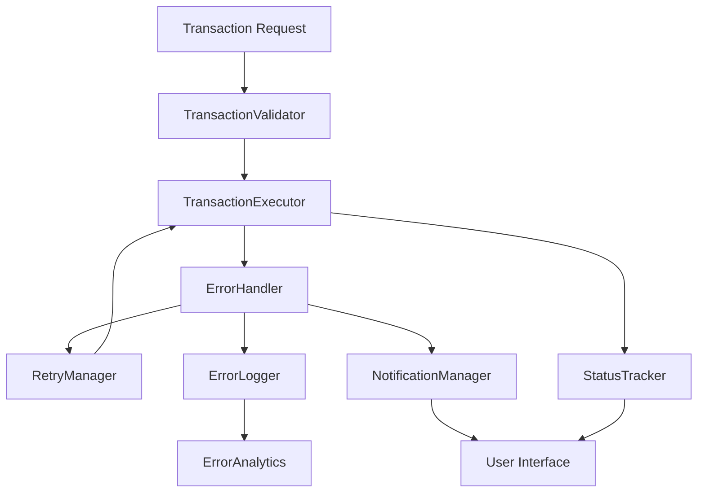

# Design Document - Advanced Transaction Error Handling System

## Overview

This design document outlines a comprehensive error handling system for blockchain transactions in the AION vault application. The system will provide professional error categorization, user-friendly messaging, automatic retry mechanisms, detailed logging, and real-time status tracking. The design focuses on creating a robust and user-centric transaction experience while maintaining detailed debugging capabilities for developers.

## Architecture

### Core Components



### Error Classification System

The system will categorize errors into the following types:

1. **Network Errors** - RPC failures, timeouts, connectivity issues
2. **Contract Errors** - Revert reasons, invalid function calls, contract not found
3. **User Errors** - Insufficient funds, user rejection, invalid parameters
4. **Gas Errors** - Gas estimation failures, gas price too low, out of gas
5. **Validation Errors** - Invalid addresses, amounts, or parameters
6. **System Errors** - Configuration issues, internal failures

## Components and Interfaces

### 1. Error Types and Interfaces

```typescript
// Core error types
export enum TransactionErrorType {
  NETWORK = 'network',
  CONTRACT = 'contract', 
  USER = 'user',
  GAS = 'gas',
  VALIDATION = 'validation',
  SYSTEM = 'system'
}

export enum TransactionErrorSeverity {
  LOW = 'low',
  MEDIUM = 'medium',
  HIGH = 'high',
  CRITICAL = 'critical'
}

export interface TransactionError {
  type: TransactionErrorType;
  severity: TransactionErrorSeverity;
  code: string;
  message: string;
  userMessage: string;
  technicalDetails: Record<string, any>;
  retryable: boolean;
  suggestedActions: string[];
  timestamp: string;
  context: TransactionContext;
}

export interface TransactionContext {
  chainId: number;
  vaultAddress: string;
  userAddress?: string;
  amount?: bigint;
  gasLimit?: bigint;
  gasPrice?: bigint;
  nonce?: number;
  blockNumber?: number;
}
```

### 2. Transaction Validator

```typescript
export interface TransactionValidator {
  validateDeposit(params: DepositParams): Promise<ValidationResult>;
  validateBalance(address: string, amount: bigint, chainId: number): Promise<boolean>;
  validateContract(address: string, chainId: number): Promise<boolean>;
  validateGasSettings(gasLimit: bigint, gasPrice: bigint): Promise<boolean>;
}

export interface ValidationResult {
  isValid: boolean;
  errors: TransactionError[];
  warnings: TransactionError[];
}
```

### 3. Error Handler

```typescript
export interface ErrorHandler {
  handleError(error: any, context: TransactionContext): TransactionError;
  categorizeError(error: any): TransactionErrorType;
  generateUserMessage(error: TransactionError): string;
  getSuggestedActions(error: TransactionError): string[];
  shouldRetry(error: TransactionError): boolean;
}
```

### 4. Retry Manager

```typescript
export interface RetryConfig {
  maxRetries: number;
  baseDelay: number;
  maxDelay: number;
  backoffMultiplier: number;
  retryableErrors: TransactionErrorType[];
}

export interface RetryManager {
  shouldRetry(error: TransactionError, attemptCount: number): boolean;
  getRetryDelay(attemptCount: number): number;
  executeWithRetry<T>(
    operation: () => Promise<T>,
    context: TransactionContext,
    config?: Partial<RetryConfig>
  ): Promise<T>;
}
```

### 5. Status Tracker

```typescript
export enum TransactionStatus {
  PREPARING = 'preparing',
  VALIDATING = 'validating',
  WAITING_CONFIRMATION = 'waiting_confirmation',
  SUBMITTED = 'submitted',
  CONFIRMING = 'confirming',
  COMPLETED = 'completed',
  FAILED = 'failed',
  RETRYING = 'retrying'
}

export interface TransactionStatusUpdate {
  status: TransactionStatus;
  message: string;
  progress?: number;
  txHash?: string;
  confirmations?: number;
  error?: TransactionError;
  timestamp: string;
}

export interface StatusTracker {
  updateStatus(update: TransactionStatusUpdate): void;
  getStatus(): TransactionStatus;
  subscribe(callback: (update: TransactionStatusUpdate) => void): () => void;
}
```

### 6. Error Logger

```typescript
export interface ErrorLogger {
  logError(error: TransactionError): void;
  logRetry(error: TransactionError, attemptCount: number): void;
  getErrorStats(): ErrorStats;
  getErrorHistory(filters?: ErrorFilters): TransactionError[];
}

export interface ErrorStats {
  totalErrors: number;
  errorsByType: Record<TransactionErrorType, number>;
  errorsBySeverity: Record<TransactionErrorSeverity, number>;
  retrySuccessRate: number;
  averageResolutionTime: number;
}
```

## Data Models

### Enhanced Transaction Parameters

```typescript
export interface EnhancedDepositParams extends DepositParams {
  retryConfig?: Partial<RetryConfig>;
  validationLevel?: 'basic' | 'strict';
  statusCallback?: (update: TransactionStatusUpdate) => void;
  errorCallback?: (error: TransactionError) => void;
}
```

### Error Context Storage

```typescript
export interface ErrorContext {
  sessionId: string;
  userAgent: string;
  walletType: string;
  networkConditions: {
    latency: number;
    blockTime: number;
    gasPrice: bigint;
  };
  previousErrors: TransactionError[];
}
```

## Error Handling Strategy

### 1. Error Detection and Classification

The system will implement a multi-layered error detection approach:

- **Pre-transaction Validation**: Validate all parameters before submission
- **Runtime Error Catching**: Catch and classify errors during execution
- **Post-transaction Analysis**: Analyze failed transactions for patterns

### 2. User-Friendly Error Messages

Error messages will be translated from technical blockchain errors to user-friendly explanations:

```typescript
const ERROR_MESSAGES = {
  INSUFFICIENT_FUNDS: {
    title: "Insufficient Balance",
    message: "You don't have enough BNB to complete this transaction.",
    action: "Please add more BNB to your wallet or reduce the deposit amount."
  },
  GAS_TOO_LOW: {
    title: "Transaction Fee Too Low", 
    message: "The network is busy and requires higher transaction fees.",
    action: "We'll automatically retry with higher fees, or you can try again later."
  },
  CONTRACT_REVERT: {
    title: "Transaction Rejected",
    message: "The smart contract rejected your transaction.",
    action: "Please check the transaction details and try again."
  }
};
```

### 3. Automatic Retry Logic

The retry system will implement intelligent retry strategies:

- **Network Errors**: Exponential backoff with jitter
- **Gas Errors**: Automatic gas price adjustment
- **Nonce Errors**: Nonce refresh and retry
- **User Errors**: No automatic retry (requires user action)

### 4. Progress Tracking

Real-time status updates will keep users informed:

1. **Preparing** (0-10%): Validating parameters
2. **Waiting Confirmation** (10-20%): Waiting for wallet approval
3. **Submitted** (20-30%): Transaction sent to network
4. **Confirming** (30-90%): Waiting for block confirmations
5. **Completed** (100%): Transaction successful

## Testing Strategy

### 1. Unit Tests

- Error classification accuracy
- Retry logic correctness
- Message generation quality
- Validation rule coverage

### 2. Integration Tests

- End-to-end error handling flows
- Retry mechanism effectiveness
- Status tracking accuracy
- Error logging completeness

### 3. Error Simulation Tests

- Network failure scenarios
- Contract revert conditions
- Gas estimation failures
- User rejection handling

### 4. Performance Tests

- Error handling overhead
- Retry mechanism efficiency
- Memory usage during errors
- Logging performance impact

## Implementation Phases

### Phase 1: Core Error Infrastructure
- Implement error types and interfaces
- Create basic error classification system
- Set up error logging framework

### Phase 2: Enhanced Transaction Flow
- Integrate validation system
- Implement status tracking
- Add user-friendly error messages

### Phase 3: Retry and Recovery
- Implement retry manager
- Add automatic recovery mechanisms
- Create retry analytics

### Phase 4: User Experience
- Add progress indicators
- Implement notification system
- Create error reporting interface

### Phase 5: Analytics and Monitoring
- Add error pattern detection
- Implement performance monitoring
- Create debugging dashboard

## Security Considerations

### 1. Error Information Disclosure
- Sanitize error messages to prevent information leakage
- Log sensitive details securely without exposing to users
- Implement rate limiting for error reporting

### 2. Retry Attack Prevention
- Limit retry attempts per user/session
- Implement exponential backoff to prevent spam
- Monitor for suspicious retry patterns

### 3. Error Injection Protection
- Validate all error inputs
- Prevent malicious error manipulation
- Secure error logging endpoints

## Performance Considerations

### 1. Error Handling Overhead
- Minimize performance impact of error checking
- Use efficient error classification algorithms
- Implement lazy loading for error details

### 2. Memory Management
- Limit error history storage
- Implement error log rotation
- Use efficient data structures for error tracking

### 3. Network Optimization
- Batch error reports when possible
- Compress error logs for transmission
- Implement offline error queuing

## Monitoring and Alerting

### 1. Error Rate Monitoring
- Track error rates by type and severity
- Alert on unusual error patterns
- Monitor retry success rates

### 2. Performance Metrics
- Measure error handling latency
- Track memory usage during errors
- Monitor error resolution times

### 3. User Experience Metrics
- Track user satisfaction with error messages
- Measure retry abandonment rates
- Monitor error-related support requests