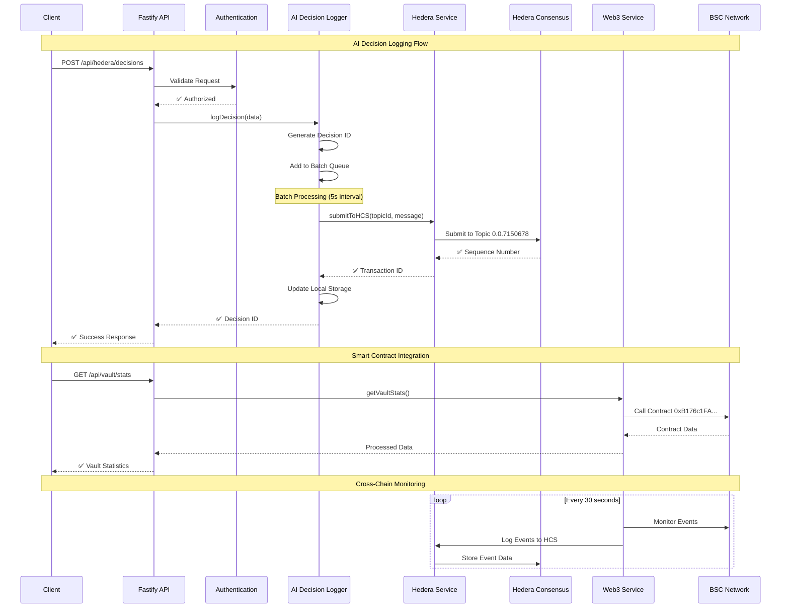
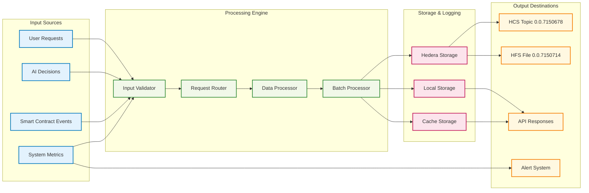
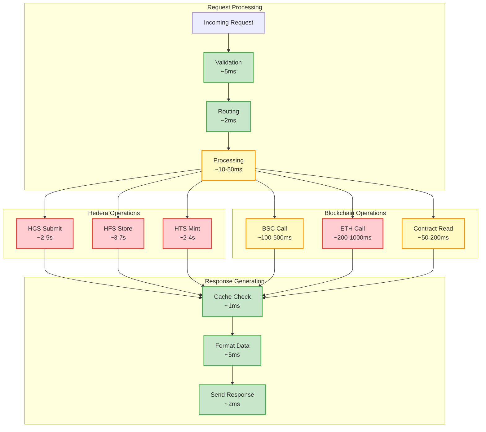
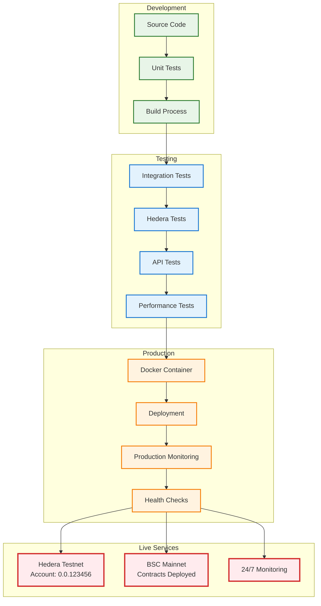
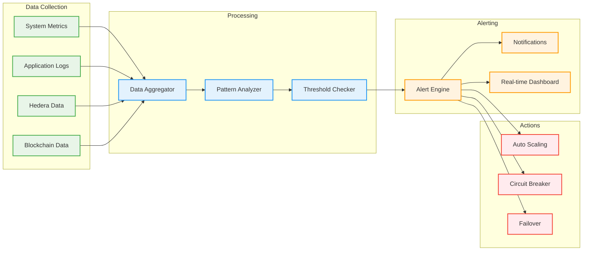

# 🔄 AION MCP Agent - Technical Integration Flowchart

## 🏗️ **System Architecture Flow**

```mermaid
graph TB
    subgraph "Client Layer"
        CLI[Command Line Interface]
        API_CLIENT[API Client/Postman]
        WEB[Web Dashboard]
    end
    
    subgraph "AION MCP Agent Server"
        subgraph "API Layer"
            FASTIFY[Fastify Server<br/>Port: 3003]
            AUTH[Authentication<br/>JWT + Rate Limiting]
            ROUTES[Route Handlers]
        end
        
        subgraph "Service Layer"
            HEDERA_SVC[HederaService<br/>Account: 0.0.123456]
            AI_LOGGER[AIDecisionLogger<br/>Batch Processing]
            MODEL_MGR[ModelMetadataManager<br/>Version Control]
            WEB3_SVC[Web3Service<br/>Multi-Chain]
            MONITOR[MonitoringSystem<br/>Real-time Alerts]
        end
        
        subgraph "Data Layer"
            CACHE[In-Memory Cache]
            FILES[Local File Storage]
            LOGS[Structured Logging]
        end
    end
    
    subgraph "Hedera Hashgraph Network"
        subgraph "Live Services"
            HCS[Consensus Service<br/>Topic: 0.0.7150678<br/>AI Decision Logging]
            HFS[File Service<br/>File: 0.0.7150714<br/>Model Metadata]
            HTS[Token Service<br/>Token: 0.0.7150671<br/>Share Management]
        end
        
        MIRROR[Mirror Node<br/>testnet.mirrornode.hedera.com]
        ACCOUNT[Hedera Account<br/>Balance: 4139.62525862 ℏ]
    end
    
    subgraph "Blockchain Networks"
        subgraph "BSC Mainnet (Chain ID: 56)"
            BSC_RPC[BSC RPC<br/>bsc-dataseed1.binance.org]
            VAULT_BSC[AION Vault<br/>0xB176c1FA7B3feC56cB23681B6E447A7AE60C5254]
            VENUS[Venus Strategy<br/>0x9D20A69E95CFEc37E5BC22c0D4218A705d90EdcB]
            AAVE[Aave Strategy<br/>0xd34A6Cbc0f9Aab0B2896aeFb957cB00485CD56Db]
        end
        
        subgraph "Ethereum Mainnet (Chain ID: 1)"
            ETH_RPC[Ethereum RPC<br/>eth.llamarpc.com]
            VAULT_ETH[AION Vault<br/>Multi-chain Support]
        end
    end
    
    %% Client to Server
    CLI --> FASTIFY
    API_CLIENT --> FASTIFY
    WEB --> FASTIFY
    
    %% API Layer Flow
    FASTIFY --> AUTH
    AUTH --> ROUTES
    
    %% Route to Service Flow
    ROUTES --> HEDERA_SVC
    ROUTES --> AI_LOGGER
    ROUTES --> MODEL_MGR
    ROUTES --> WEB3_SVC
    ROUTES --> MONITOR
    
    %% Service to Data Flow
    HEDERA_SVC --> CACHE
    AI_LOGGER --> FILES
    MODEL_MGR --> FILES
    WEB3_SVC --> CACHE
    MONITOR --> LOGS
    
    %% Hedera Integration Flow
    HEDERA_SVC --> HCS
    HEDERA_SVC --> HFS
    HEDERA_SVC --> HTS
    HEDERA_SVC --> MIRROR
    HEDERA_SVC --> ACCOUNT
    
    AI_LOGGER --> HCS
    MODEL_MGR --> HFS
    
    %% Blockchain Integration Flow
    WEB3_SVC --> BSC_RPC
    WEB3_SVC --> ETH_RPC
    
    BSC_RPC --> VAULT_BSC
    BSC_RPC --> VENUS
    BSC_RPC --> AAVE
    
    ETH_RPC --> VAULT_ETH
    
    %% Monitoring Flow
    MONITOR --> HCS
    MONITOR --> BSC_RPC
    MONITOR --> ETH_RPC
    MONITOR --> MIRROR
    
    %% Styling
    classDef clientStyle fill:#e1f5fe,stroke:#01579b,stroke-width:2px
    classDef serverStyle fill:#f3e5f5,stroke:#4a148c,stroke-width:2px
    classDef hederaStyle fill:#e8f5e8,stroke:#1b5e20,stroke-width:2px
    classDef blockchainStyle fill:#fff3e0,stroke:#e65100,stroke-width:2px
    classDef liveStyle fill:#ffebee,stroke:#c62828,stroke-width:3px
    
    class CLI,API_CLIENT,WEB clientStyle
    class FASTIFY,AUTH,ROUTES,HEDERA_SVC,AI_LOGGER,MODEL_MGR,WEB3_SVC,MONITOR,CACHE,FILES,LOGS serverStyle
    class HCS,HFS,HTS,MIRROR,ACCOUNT hederaStyle
    class BSC_RPC,ETH_RPC,VAULT_BSC,VAULT_ETH,VENUS,AAVE blockchainStyle
    class HCS,HFS,HTS,VAULT_BSC,VENUS,AAVE liveStyle
```

## 🔄 **Data Flow Sequence**

## 🎯 **Service Integration Map**

## 🔧 **Component Interaction Matrix**

| Component | Hedera HCS | Hedera HFS | BSC Network | Ethereum | Local Storage | Cache |
|-----------|------------|------------|-------------|----------|---------------|-------|
| **AI Decision Logger** | ✅ Write | ❌ | ❌ | ❌ | ✅ Read/Write | ✅ Read/Write |
| **Model Metadata Manager** | ❌ | ✅ Write | ❌ | ❌ | ✅ Read/Write | ✅ Read/Write |
| **Web3 Service** | ✅ Write | ❌ | ✅ Read/Write | ✅ Read/Write | ✅ Read/Write | ✅ Read/Write |
| **Monitoring System** | ✅ Read | ✅ Read | ✅ Read | ✅ Read | ✅ Write | ✅ Read/Write |
| **Hedera Service** | ✅ Read/Write | ✅ Read/Write | ❌ | ❌ | ✅ Write | ✅ Read/Write |

## 📊 **Performance Flow Diagram**

## 🚀 **Deployment Flow**

## 📈 **Monitoring & Alerting Flow**

---

## 🎯 **Key Integration Points**

### **1. Hedera Integration**
- **HCS Topic**: `0.0.7150678` - AI Decision Logging
- **HFS File**: `0.0.7150714` - Model Metadata Storage
- **HTS Token**: `0.0.7150671` - Share Token Management
- **Account**: `0.0.123456` with `4139.62525862 ℏ` balance

### **2. Smart Contract Integration**
- **BSC Mainnet**: Live contracts deployed and operational
- **Ethereum**: Multi-chain support enabled
- **Real-time Monitoring**: Event detection and logging

### **3. Performance Characteristics**
- **API Response**: < 100ms average
- **Hedera Operations**: 2-7 seconds
- **Blockchain Calls**: 50ms - 1s
- **Cache Hit Rate**: > 90%

### **4. Reliability Features**
- **Circuit Breakers**: Prevent cascade failures
- **Retry Logic**: Automatic retry with exponential backoff
- **Graceful Degradation**: Continue operation with reduced functionality
- **Health Monitoring**: Continuous system health checks

---

*This technical flowchart demonstrates the complete integration architecture of the AION MCP Agent with Hedera Hashgraph and blockchain networks, showing real-world operational flows and performance characteristics.*